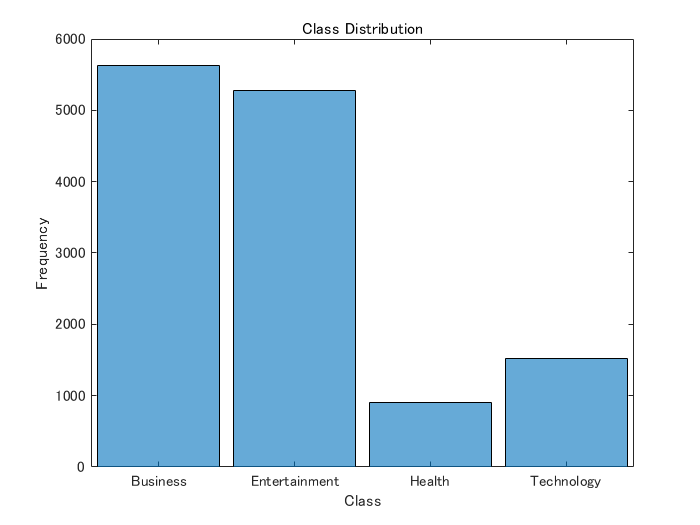
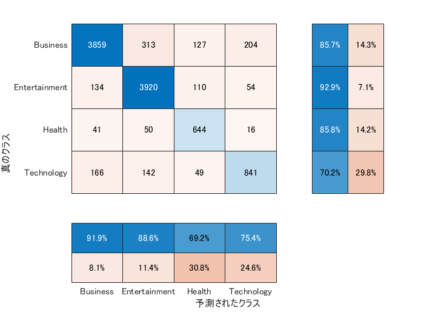
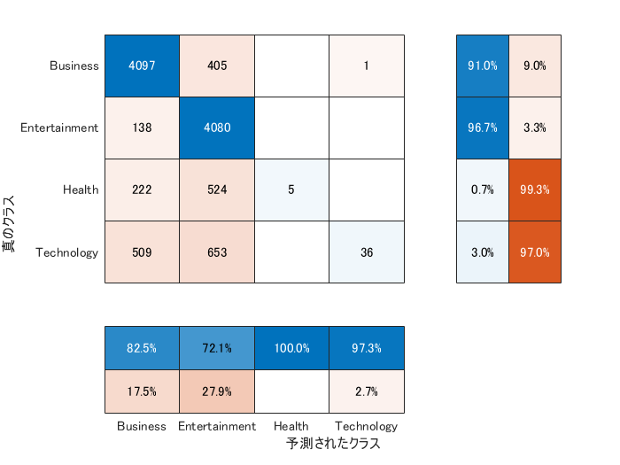
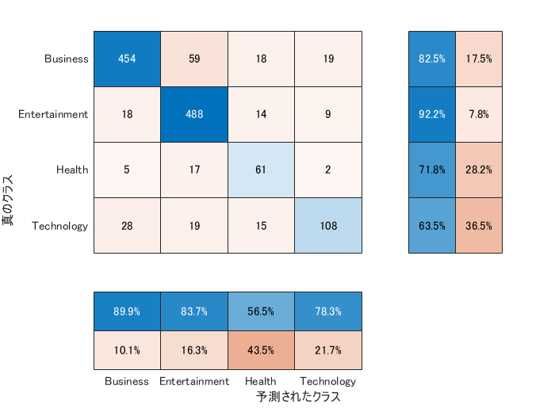
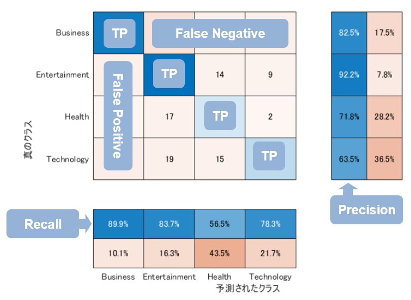
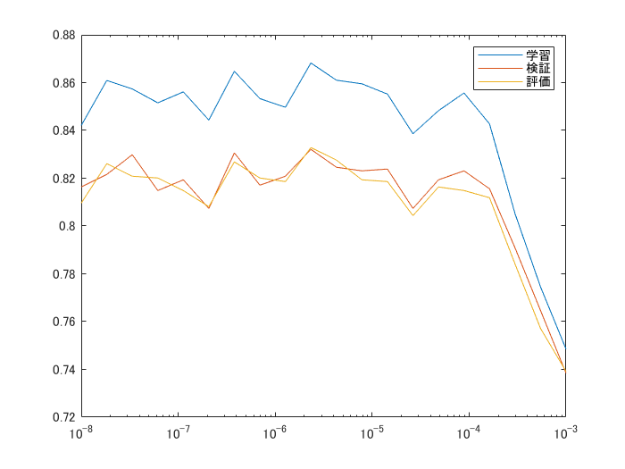
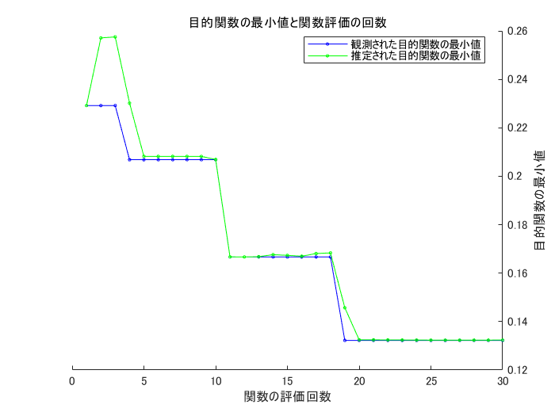
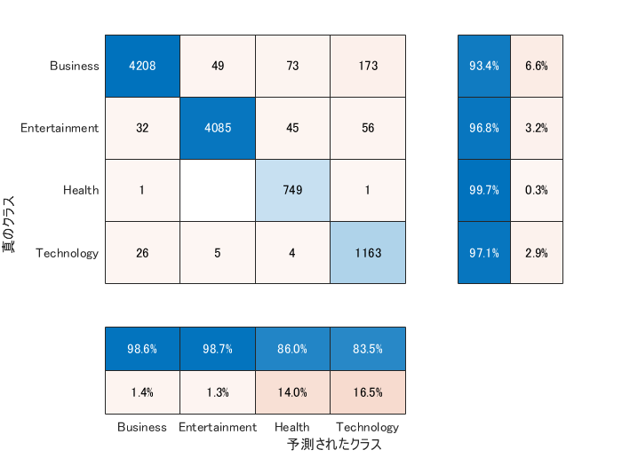
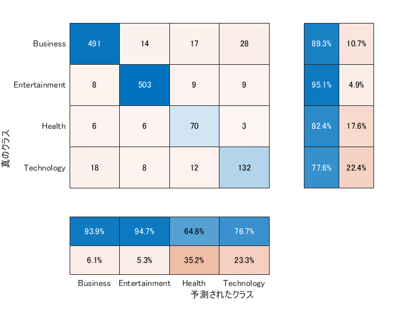

# 第6章: 機械学習
> 本章では，Fabio Gasparetti氏が公開している[News Aggregator Data Set](https://archive.ics.uci.edu/ml/datasets/News+Aggregator)を用い，ニュース記事の見出しを「ビジネス」「科学技術」「エンターテイメント」「健康」のカテゴリに分類するタスク（カテゴリ分類）に取り組む


## 実行環境 


MATLAB R2020a (Windows 10)


ここでの結果は問題70でも使うとのことなので、再現性があるように乱数シードを固定しておきます。


```matlab:Code
clear
rng(0)
```

# 50. データの入手・整形
> [News Aggregator Data Set](https://archive.ics.uci.edu/ml/datasets/News+Aggregator)をダウンロードし、以下の要領で学習データ（`train.txt`），検証データ（`valid.txt`），評価データ（`test.txt`）を作成せよ．
>
>   1.  ダウンロードしたzipファイルを解凍し，`readme.txt`の説明を読む． 
>   1.  情報源（publisher）が”Reuters”, “Huffington Post”, “Businessweek”, “Contactmusic.com”, “Daily Mail”の事例（記事）のみを抽出する． 
>   1.  抽出された事例をランダムに並び替える． 
>   1.  抽出された事例の80%を学習データ，残りの10%ずつを検証データと評価データに分割し，それぞれ`train.txt`，`valid.txt`，`test.txt`というファイル名で保存する．ファイルには，１行に１事例を書き出すこととし，カテゴリ名と記事見出しのタブ区切り形式とせよ（このファイルは後に問題70で再利用する）． 
>
> 学習データと評価データを作成したら，各カテゴリの事例数を確認せよ．


ダウンロードされた zip を解凍し、`newCorpora.csv` というファイルが同じディレクトリに展開されている想定で進めます。`readme.txt` によると、`newCorpora.csv` には以下の8個の変数が tab 区切りで入っている模様。


```matlab:Code(Display)
FORMAT: ID \t TITLE \t URL \t PUBLISHER \t CATEGORY \t STORY \t HOSTNAME \t TIMESTAMP

where:
ID		Numeric ID
TITLE		News title 
URL		Url
PUBLISHER	Publisher name
CATEGORY	News category (b = business, t = science and technology, e = entertainment, m = health)
STORY		Alphanumeric ID of the cluster that includes news about the same story
HOSTNAME	Url hostname
TIMESTAMP 	Approximate time the news was published, as the number of milliseconds since the epoch 00:00:00 GMT, January 1, 1970
```


[readtable](https://jp.mathworks.com/help/matlab/ref/readtable.html) 関数で読み込みます。デフォルト設定で何とかなりそうです。


```matlab:Code
data = readtable('newsCorpora.csv');
varNames = ["ID","Title","URL","Publisher","Category","Story","Hostname","TimeStamp"];
data.Properties.VariableNames = varNames;
```


変数名もちゃんと付けておきます。冒頭だけ眺めてみると以下。


```matlab:Code
head(data)
```

| |ID|Title|URL|Publisher|Category|Story|Hostname|TimeStamp|
|:--:|:--:|:--:|:--:|:--:|:--:|:--:|:--:|:--:|
|1|1|'Fed official says w...|'http://www.latimes....|'Los Angeles Times'|'b'|'ddUyU0VZz0BRneMioxU...|'www.latimes.com'|1.3945e+12|
|2|2|'Fed's Charles Ploss...|'http://www.livemint...|'Livemint'|'b'|'ddUyU0VZz0BRneMioxU...|'www.livemint.com'|1.3945e+12|
|3|3|'US open: Stocks fal...|'http://www.ifamagaz...|'IFA Magazine'|'b'|'ddUyU0VZz0BRneMioxU...|'www.ifamagazine.com...|1.3945e+12|
|4|4|'Fed risks falling '...|'http://www.ifamagaz...|'IFA Magazine'|'b'|'ddUyU0VZz0BRneMioxU...|'www.ifamagazine.com...|1.3945e+12|
|5|5|'Fed's Plosser: Nast...|'http://www.moneynew...|'Moneynews'|'b'|'ddUyU0VZz0BRneMioxU...|'www.moneynews.com'|1.3945e+12|
|6|6|'Plosser: Fed May Ha...|'http://www.nasdaq.c...|'NASDAQ'|'b'|'ddUyU0VZz0BRneMioxU...|'www.nasdaq.com'|1.3945e+12|
|7|7|'Fed's Plosser: Tape...|'http://www.marketwa...|'MarketWatch'|'b'|'ddUyU0VZz0BRneMioxU...|'www.marketwatch.com...|1.3945e+12|
|8|8|'Fed's Plosser expec...|'http://www.fxstreet...|'FXstreet.com'|'b'|'ddUyU0VZz0BRneMioxU...|'www.fxstreet.com'|1.3945e+12|


この後使うのは Title・Publisher・Category のみ。それぞれ取り扱いやすいように string 型・string型・カテゴリ型に変えておきます。


```matlab:Code
data.Category = categorical(data.Category);
data.Publisher = string(data.Publisher);
data.Title = string(data.Title);
```

## カテゴリ型補足


b = business, t = science and technology, e = entertainment, m = health だと分かりにくいので、変えておきます。


```matlab:Code
categories(data.Category)
```


```text:Output
ans = 4x1 cell    
'b'          
'e'          
'm'          
't'          

```


が現在のカテゴリ一覧。この順であたらしいカテゴリ名を与えて変更します。


```matlab:Code
data.Category = renamecats(data.Category,["Business","Entertainment","Health","Technology"]);

```

## 情報源の絞り込み
> 情報源（publisher）が"Reuters”, “Huffington Post”, “Businessweek”, “Contactmusic.com”, “Daily Mail”の事例（記事）のみを抽出する．


とのことですが、事例（記事）というのは TITLE のことでいいのかな・・いいとします。


`ismember` 関数で進めます。


```matlab:Code
selected = ["Reuters","Huffington Post","Businessweek","Contactmusic.com","Daily Mail"];
idxSelected = ismember(data.Publisher,selected);
dataSelected = data(idxSelected,["Title","Category"]);
head(dataSelected)
```

| |Title|Category|
|:--:|:--:|:--:|
|1|"Europe reaches crun...|Business|
|2|"ECB FOCUS-Stronger ...|Business|
|3|"Euro Anxieties Wane...|Business|
|4|"Noyer Says Strong E...|Business|
|5|"REFILE-Bad loan tri...|Business|
|6|"UPDATE 1-ECB to rev...|Business|
|7|"Central banks must ...|Business|
|8|"UPDATE 1-Central ba...|Business|

## 抽出された事例をランダムに並び替え


ここは `randperm` で行きます。順番をランダムに入れ替えたベクトルを返してくれます。


```matlab:Code
randperm(10)
```


```text:Output
ans = 1x10    
     6     3     7     8     5     1     2     4     9    10

```


こんな感じ。なので、`dataSelected` のデータの数を入力して、インデックスとして使えば順番がランダムに入れ替わります。


```matlab:Code
Ntotal = height(dataSelected);
idxRandom = randperm(Ntotal);
dataRandom = dataSelected(idxRandom,:);
```

## データ分割
> 4. 抽出された事例の80%を学習データ，残りの10%ずつを検証データと評価データに分割し，それぞれ`train.txt`，`valid.txt`，`test.txt`というファイル名で保存する．ファイルには，１行に１事例を書き出すこととし，カテゴリ名と記事見出しのタブ区切り形式とせよ（このファイルは後に問題70で再利用する）．


何かそれ用の関数がありそうな気がします（[`cvpartition`](https://jp.mathworks.com/help/stats/cvpartition.html) 関数とか）がここは分かりやすく、ただ単純にそのまま上から順に 80%/10%/10% を取ります。


```matlab:Code
vars = ["Category","Title"];
Ntrain = Ntotal*0.8;
Nvalid = Ntotal*0.1;
Ntest = Ntotal*0.1;
dataTrain = dataRandom(1:Ntrain,vars);
dataValid = dataRandom(Ntrain+1:Ntrain+Nvalid,vars);
dataTest = dataRandom(Ntrain+Nvalid+1:end,vars);
```


ファイルへの出力は `writetable` 関数で。`delimiter` で区切り文字を指定しておきます。


```matlab:Code
writetable(dataTrain,'train.txt');
writetable(dataValid,'valid.txt');
writetable(dataTest,'test.txt');
```


カテゴリーの分類を見ておきます。


```matlab:Code
histogram(dataRandom.Category)
xlabel("Class")
ylabel("Frequency")
title("Class Distribution")
```





Health カテゴリ、Science and Technology カテゴリの記事は少ない模様。


分割したそれぞれのデータでの分布も念のため確認。


```matlab:Code
tabulate(dataTrain.Category)
```


```text:Output
          Value    Count   Percent
       Business     4503     42.19%
  Entertainment     4219     39.53%
         Health      751      7.04%
     Technology     1199     11.24%
```


```matlab:Code
tabulate(dataValid.Category)
```


```text:Output
          Value    Count   Percent
       Business      574     43.03%
  Entertainment      531     39.81%
         Health       74      5.55%
     Technology      155     11.62%
```


```matlab:Code
tabulate(dataTest.Category)
```


```text:Output
          Value    Count   Percent
       Business      550     41.23%
  Entertainment      529     39.66%
         Health       85      6.37%
     Technology      170     12.74%
```


大きく外れていないので良し！


# 51. 特徴量抽出
> 学習データ，検証データ，評価データから特徴量を抽出し，それぞれ`train.feature.txt`，`valid.feature.txt`，`test.feature.txt`というファイル名で保存せよ． なお，カテゴリ分類に有用そうな特徴量は各自で自由に設計せよ．記事の見出しを単語列に変換したものが最低限のベースラインとなるであろう.


ここでは Text Analytics Toolbox のデモコード "[Create Simple Text Model for Classification](https://jp.mathworks.com/help/textanalytics/ug/create-simple-text-model-for-classification.html)" を参考に（マネして）進めます。


## 前処理


まず特徴量抽出の前処理部分ですが、デモコードで使われているものをそのまま活用します。


```matlab:Code(Display)
function documents = preprocessText(textData)
    
    % Tokenize the text.
    documents = tokenizedDocument(textData);
    
    % Remove a list of stop words then lemmatize the words. To improve
    % lemmatization, first use addPartOfSpeechDetails.
    documents = addPartOfSpeechDetails(documents);
    documents = removeStopWords(documents);
    documents = normalizeWords(documents,'Style','lemma');
    
    % Erase punctuation.
    documents = erasePunctuation(documents);
    
    % Remove words with 2 or fewer characters, and words with 15 or more
    % characters.
    documents = removeShortWords(documents,2);
    documents = removeLongWords(documents,15);
    
end
```


以下の処理をしています。


   1.  [`tokenizedDocument`](https://jp.mathworks.com/help/textanalytics/ref/tokenizeddocument.html) で入力文をトークン化（単語に分割） 
   1.  [`removeStopWords`](https://jp.mathworks.com/help/textanalytics/ref/tokenizeddocument.removestopwords.html) でand, of, the などのストップワードを削除 
   1.  [`normalizeWords`](https://jp.mathworks.com/help/textanalytics/ref/normalizewords.html) で各単語を原型（？）にそろえる 
   1.  [`erasePunctuation`](https://jp.mathworks.com/help/textanalytics/ref/tokenizeddocument.erasepunctuation.html) でコンマやピリオドなど削除 
   1.  [`removeShortWords`](https://jp.mathworks.com/help/textanalytics/ref/tokenizeddocument.removeshortwords.html) で 2文字以下の単語を削除 
   1.  [`removeLongWords`](https://jp.mathworks.com/help/textanalytics/ref/tokenizeddocument.removelongwords.html) で 15 文字以上の単語を削除 


最低限のベースラインよりは少しは手が加わっているかな？


```matlab:Code
documents = preprocessText(dataTrain.Title);
```


処理結果を原文と比較してみると以下の通り。人間には読みにくいですが。


```matlab:Code
documents(1:5)
```


```text:Output
ans = 
  5x1 tokenizedDocument:

    8 tokens: same engineer design switch 595 million recall car
    9 tokens: hormel foods buy muscle milk product maker cytosport holdings
    5 tokens: beer tour germany lady rock
    7 tokens: murdoch bid boosts carey james jockeys position
    8 tokens: update 2us judge decline order park notice car

```


```matlab:Code
dataTrain.Title(1:5)
```


```text:Output
ans = 5x1 string    
"Same engineer designed swit…  
"Hormel Foods to buy Muscle …  
"Beer Touring in Germany: Wh…  
"Murdoch Bid Boosts Carey as…  
"UPDATE 2-US judge declines …  

```

## Bag of Words


シンプルに文書中に出現する単語を数え、その数を特徴とする手法を使います。 文の中での出現順序は考慮しないシンプルな表現ですが、単語数が多い＝データの次元が膨大になる点には要注意。


```matlab:Code
bag = bagOfWords(documents)
```


```text:Output
bag = 
  bagOfWords のプロパティ:

          Counts: [10672x13133 double]
      Vocabulary: [1x13133 string]
        NumWords: 13133
    NumDocuments: 10672

```

## おまけの処理


ここで、2 回以下しか登場しない単語（ 3 回以上出てこない）は削除します。その結果、元文章（Title）が空になってしまうデータも一緒に取り除いておく処理をします。


```matlab:Code
bag = removeInfrequentWords(bag,2);
[bag,idx] = removeEmptyDocuments(bag);
length(idx)
```


```text:Output
ans = 2
```


3 つあるみたいですね・・。一応確認しておきます。元タイトルとトークン化後。


```matlab:Code
dataTrain(idx,:)
```

| |Category|Title|
|:--:|:--:|:--:|
|1|Entertainment|"Who's Paddy?"|
|2|Technology|"Don't Undervalue Im...|


```matlab:Code
documents(idx,:)
```


```text:Output
ans = 
  2x1 tokenizedDocument:

    1 tokens: paddy
    3 tokens: undervalue importance cobenefits

```


確かに他に出てこないのであれば学習データとしてあまり価値がなさそうですね。削除します。単語数が 13202 から 5012 まで劇的に減っている点に注目。


```matlab:Code
dataTrain2 = dataTrain;
dataTrain2(idx,:) = [];
bag
```


```text:Output
bag = 
  bagOfWords のプロパティ:

          Counts: [10670x5010 double]
      Vocabulary: [1x5010 string]
        NumWords: 5010
    NumDocuments: 10670

```


単語数が 13202 から 5012 まで劇的に減っています。


# 52. 学習
> 51で構築した学習データを用いて，ロジスティック回帰モデルを学習せよ．


ロジスティック回帰ですが、3 個以上のクラス分けなのでマルチクラス モデルの近似を行う [fitcecoc](https://jp.mathworks.com/help/stats/fitcecoc.html) を使用します。デフォルトだと各クラス 1 対 1 分類をする設定で SVM を使うので、その辺はロジスティック回帰を使う用に変えておきます。


```matlab:Code
XTrain = bag.Counts; % 特徴量
YTrain = dataTrain2.Category; % カテゴリ（応答変数）

% 使用する学習器テンプレート
t = templateLinear('Learner','logistic');
mdl = fitcecoc(XTrain,YTrain,'Learners',t,'Prior',"uniform",'Coding','onevsall')
```


```text:Output
mdl = 
  classreg.learning.classif.CompactClassificationECOC
      ResponseName: 'Y'
        ClassNames: [Business    Entertainment    Health    Technology]
    ScoreTransform: 'none'
    BinaryLearners: {4x1 cell}
      CodingMatrix: [4x4 double]

  Properties, Methods

```


こんなモデルができました。


学習データでの予測精度も見ておきます。


```matlab:Code
categoryPred = predict(mdl,XTrain);
confusionchart(YTrain, categoryPred, ...
    'ColumnSummary',"column-normalized",...
    'RowSummary',"row-normalized");
```





それらしい結果となりました。いくつかポイントをまとめます。


```matlab:Code(Display)
mdl = fitcecoc(XTrain,YTrain,'Learners',t,'Prior',"uniform",'Coding','onevsall');
```

## Prior: "uniform"


まず事前確率。これはデフォルトでは学習データ内での各クラスの出現確率に依存する "emperical" という設定になっています。ただ上で見たとおり、学習データが特定のカテゴリに偏っているので、バイアスなく予測するモデルを学習するために事前確率は均等だという設定にします。


ロジスティック回帰の場合は以下の通り大きな影響を受けます。


```matlab:Code
mdl2 = fitcecoc(XTrain,YTrain,'Learners',t,'Prior',"empirical",'Coding','onevsall');
categoryPred = predict(mdl2,XTrain);
confusionchart(YTrain, categoryPred, ...
    'ColumnSummary',"column-normalized",...
    'RowSummary',"row-normalized");
```




## Coding: "onevsall"


特に設定しなければデフォルトで "onevsone" 設定です。詳細：['Coding' — 符号化設計](https://jp.mathworks.com/help/stats/fitcecoc.html#bufm0zb-1)


これは多クラス分類を行う際に、2 値分類の手法（SVM,ロジスティック回帰）をどの使うかを指定します。


学習されたモデルの中身をみると分かりやすいのですが、"onevall" だと 


   -  Business vs その他 
   -  Health vs その他 


などの分類を行う 4 つの分類器が学習されていることが分かります。後ほど出てくる「効いている特徴量」などを判断するにはこちらの方がよいですね。


```matlab:Code
mdl.BinaryLearners
```

| |1|
|:--:|:--:|
|1|1x1 ClassificationLi...|
|2|1x1 ClassificationLi...|
|3|1x1 ClassificationLi...|
|4|1x1 ClassificationLi...|


デフォルトの "onevsone" は各クラスそれぞれを分類するモデルを作る設定ですので、結果として今回の場合は 6 つのモデルができます。以下は参考まで。


```matlab:Code
mdl3 = fitcecoc(XTrain,YTrain,'Learners',t,'Prior',"uniform",'Coding','onevsone');
mdl3.BinaryLearners
```

| |1|
|:--:|:--:|
|1|1x1 ClassificationLi...|
|2|1x1 ClassificationLi...|
|3|1x1 ClassificationLi...|
|4|1x1 ClassificationLi...|
|5|1x1 ClassificationLi...|
|6|1x1 ClassificationLi...|

# 53. 予測
> 52で学習したロジスティック回帰モデルを用い，与えられた記事見出しからカテゴリとその予測確率を計算するプログラムを実装せよ．


前処理して、Bag-of-Words モデルで符号化（特徴量化）して予測までを関数化します。


```matlab:Code(Display)
function [class, score] = predictClassFromTitle(mdl,bag,title)
    documentsTest = preprocessText(title);
    XTest = encode(bag,documentsTest);
    [class,~,~,posterior] = predict(mdl,XTest);
    % class は予想されるカテゴリ
    % posterior は各クラスに分類される確率
    % なので最大値が "class" に予測される確率
    score = max(posterior,[],2); 
end
```

  

```matlab:Code
[class, score] = predictClassFromTitle(mdl,bag,dataTest.Title(1:2))
```


```text:Output
class = 2x1 categorical    
Health       
Business     

score = 2x1    
    0.6416
    0.4788

```

# 54. 正解率の計測
> 52で学習したロジスティック回帰モデルの正解率を，学習データおよび評価データ上で計測せよ．


改めて学習データの正解率から。


```matlab:Code
YPredTrain = predict(mdl,XTrain);
sum(YPredTrain == YTrain)/numel(YTrain)
```


```text:Output
ans = 0.8682
```


評価データについても同様に。


```matlab:Code
YTest = dataTest.Category;
[YPredTest, score] = predictClassFromTitle(mdl,bag,dataTest.Title);
sum(YPredTest == YTest)/numel(YTest)
```


```text:Output
ans = 0.8328
```

# 55. 混同行列の作成
> 52で学習したロジスティック回帰モデルの混同行列（confusion matrix）を，学習データおよび評価データ上で作成せよ．


まずは学習データの混同行列


```matlab:Code
confusionchart(YTrain, YPredTrain,...
    'ColumnSummary',"column-normalized",...
    'RowSummary',"row-normalized");
```


そして評価データの混同行列（出力を `cm` で確保しておき後ほど使います）


```matlab:Code
cm = confusionchart(YTest, YPredTest,...
    'ColumnSummary',"column-normalized",...
    'RowSummary',"row-normalized");
```




# 56. 適合率，再現率，F1スコアの計測
> 52で学習したロジスティック回帰モデルの適合率，再現率，F1スコアを，評価データ上で計測せよ．カテゴリごとに適合率，再現率，F1スコアを求め，カテゴリごとの性能をマイクロ平均（micro-average）とマクロ平均（macro-average）で統合せよ．


それぞれの意味は下記がかなり丁寧にまとめて頂いているのでどうぞ。


[【入門者向け】機械学習の分類問題評価指標解説(正解率・適合率・再現率など)](https://qiita.com/FukuharaYohei/items/be89a99c53586fa4e2e4#%E5%A4%9A%E3%82%AF%E3%83%A9%E3%82%B9%E5%88%86%E9%A1%9E)


上で求めた混同行列に書き込むと以下の通り：





式で書くと：


   -  Precision (適合率) = True Positive / (True Positive + False Positive) = 正予測の正答率 
   -  Recall (再現率) = True Positive / (True Positive + False Negative) = 正に対する正答率 
   -  F1スコア = 2 x (Precision x Recall) / (Precision + Recall) 


上で確保した `cm` から混同行列の数値を取って、実際に計算してみます。


```matlab:Code
confMat = cm.NormalizedValues;

precision = zeros(4,1);
recall = zeros(4,1);

% Precision (適合率) = True Positive / (True Positive + False Positive)
for ii = 1:size(confMat,1)
    precision(ii)=confMat(ii,ii)/sum(confMat(ii,:));
end

% Recall(再現率) = True Positive / (True Positive + False Negative)
for ii = 1:size(confMat,2)
    recall(ii)=confMat(ii,ii)/sum(confMat(:,ii));
end

% F1スコア = 2 x (Precision x Recall) / (Precision + Recall)
F1 = 2*(precision.*recall)./(precision+recall);

% table 型にまとめて表示
scores = table(precision,recall,F1);
scores.Row = ["Business", "Entertainment", "Health", "Technology"]
```

| |precision|recall|F1|
|:--:|:--:|:--:|:--:|
|1 Business|0.8255|0.8990|0.8607|
|2 Entertainment|0.9225|0.8370|0.8777|
|3 Health|0.7176|0.5648|0.6321|
|4 Technology|0.6353|0.7826|0.7013|

## マイクロ平均（micro-average）とマクロ平均（macro-average）


上で紹介した記事にも記載がありますが、


   -  マクロ平均は単純な算術平均(相加平均)：各クラスごとの正解率、適合率等の値を平均するだけ 
   -  マイクロ平均は混合行列全体からTP等の値集計をして算出であり 


ということで、マクロ平均は


```matlab:Code
macroAve = varfun(@mean,scores)
```

| |mean_precision|mean_recall|mean_F1|
|:--:|:--:|:--:|:--:|
|1|0.7752|0.7709|0.7679|


そしてマイクロ平均は適合率，再現率，F1スコアともに同じ値になります。


```matlab:Code
trace(confMat)/sum(confMat(:))
```


```text:Output
ans = 0.8328
```

# 57. 特徴量の重みの確認
> 52で学習したロジスティック回帰モデルの中で，重みの高い特徴量トップ10と，重みの低い特徴量トップ10を確認せよ．


各クラスとそれ以外を分類する 4 つの回帰モデルの重みを確認して、各１つのクラスを他クラスから分類する特徴量トップ10を確認します。


順番は


```matlab:Code
mdl.ClassNames
```


```text:Output
ans = 4x1 categorical    
Business         
Entertainment    
Health           
Technology       

```


で確認できます。以下、それぞれそれっぽい単語が確認できます。


## Business vs others

```matlab:Code
coef = mdl.BinaryLearners{1}.Beta;
[~,idx] = sort(coef,'descend');
[string(coef(idx(1:10))),bag.Vocabulary(idx(1:10))']
```


```text:Output
ans = 10x2 string    
"0.70628"    "low"        
"0.70023"    "bank"       
"0.69599"    "fed"        
"0.66601"    "euro"       
"0.66279"    "ecb"        
"0.66182"    "china"      
"0.65203"    "update"     
"0.5804"     "rise"       
"0.5773"     "profit"     
"0.55126"    "high"       

```

## Entertainment vs others

```matlab:Code
coef = mdl.BinaryLearners{2}.Beta;
[~,idx] = sort(coef,'descend');
[string(coef(idx(1:10))),bag.Vocabulary(idx(1:10))']
```


```text:Output
ans = 10x2 string    
"0.92388"    "kardashian"    
"0.73854"    "kim"           
"0.60877"    "star"          
"0.54974"    "cyrus"         
"0.54974"    "miley"         
"0.5419"     "chris"         
"0.426"      "justin"        
"0.42167"    "bieber"        
"0.41351"    "film"          
"0.41033"    "movie"         

```

## Health vs others

```matlab:Code
coef = mdl.BinaryLearners{3}.Beta;
[~,idx] = sort(coef,'descend');
[string(coef(idx(1:10))),bag.Vocabulary(idx(1:10))']
```


```text:Output
ans = 10x2 string    
"1.2932"     "ebola"       
"1.2065"     "drug"        
"1.1688"     "study"       
"1.0042"     "cancer"      
"0.8444"     "fda"         
"0.73315"    "health"      
"0.73187"    "mers"        
"0.65464"    "heart"       
"0.6027"     "outbreak"    
"0.58848"    "virus"       

```

## Technology vs others 

```matlab:Code
coef = mdl.BinaryLearners{4}.Beta;
[coefsort,idx] = sort(coef,'descend');
[string(coef(idx(1:10))),bag.Vocabulary(idx(1:10))']
```


```text:Output
ans = 10x2 string    
"1.377"      "google"       
"1.0362"     "apple"        
"0.94431"    "facebook"     
"0.76967"    "climate"      
"0.6199"     "microsoft"    
"0.56628"    "recall"       
"0.47101"    "car"          
"0.45785"    "tesla"        
"0.4374"     "space"        
"0.41975"    "fcc"          

```

# 58. 正則化パラメータの変更
> ロジスティック回帰モデルを学習するとき，正則化パラメータを調整することで，学習時の過学習（overfitting）の度合いを制御できる．異なる正則化パラメータでロジスティック回帰モデルを学習し，学習データ，検証データ，および評価データ上の正解率を求めよ．実験の結果は，正則化パラメータを横軸，正解率を縦軸としたグラフにまとめよ．


正則化パラメータは `'Lambda'` で指定するんですが、ドキュメンテーションページを確認すると他にもいろいろ選択肢がある。


引用元：[templateLinear: 線形分類学習器テンプレート](https://jp.mathworks.com/help/stats/templatelinear.html)


`'Lambda'` 以外を特に何も指定しない場合のデフォルトの挙動を確認しておきます。ペナルティは `'lasso'` か `'ridge'` かを `'Regularization'` で指定できるけども、


> [`Solver`](https://jp.mathworks.com/help/releases/R2020a/stats/templatelinear.html#bu216oi-Solver) が `'sparsa'` の場合、`Regularization` の既定値は `'lasso'` になります。それ以外の場合は、既定値は `'ridge'` です。


とのこと。では Solver の既定値はなんだろう・・とみると


   -  予測子データセットに 100 個以下の予測子変数が格納されている場合にリッジ ペナルティ (`Regularization` を参照) を指定すると、既定のソルバーは `'bfgs'` になります。 
   -  予測子データセットに 100 個より多い予測子変数が格納されている場合に SVM モデル (`Learner` を参照) とリッジ ペナルティを指定すると、既定のソルバーは `'dual'` になります。 
   -  予測子データセットに 100 個以下の予測子変数が格納されている場合に LASSO ペナルティを指定すると、既定のソルバーは `'sparsa'` になります。 

> それ以外の場合、既定のソルバーは `'sgd'` になります。


だそうな。


今回の場合は、変数は 5000 個ほどあり、`'Learner'` は `'logistic'` を使っているので、Solver は `'sgd'` （確率的勾配降下法）のはず。ということで、何も指定しなければペナルティは `'ridge'`。ここではあえて `'Lasso'` を指定してやってみます。


```matlab:Code
Nmodels = 20; % 試す正則化パラメータの数
Lambda = logspace(-8,-3,Nmodels); % 1e-8 から 1e-3 までの値で計算させてみます。

XTrain = bag.Counts;
YTrain = dataTrain2.Category;
t = templateLinear('Learner','logistic','Lambda',Lambda,'Regularization','lasso');
mdl = fitcecoc(XTrain,YTrain,'Learners',t,'Prior',"uniform",'Coding','onevsall');
```


それぞれのデータセットでの正解率を確認します。


```matlab:Code
% 学習データでの正解率
YPred = predict(mdl,XTrain);
accTrain = sum(YPred == YTrain)/numel(YTrain);

% 検証データでの精度
documentsValid = preprocessText(dataValid.Title);
XValid = encode(bag,documentsValid);
YValid = dataValid.Category;
YPred = predict(mdl,XValid);
accValid = sum(YPred == YValid)/numel(YValid);

% 評価データでの精度
documentsTest = preprocessText(dataTest.Title);
XTest = encode(bag,documentsTest);
YTest = dataTest.Category;
YPred = predict(mdl,XTest);
accTest = sum(YPred == YTest)/numel(YTest);
```


精度をプロットします。


正則化パラメータが大きいと過学習（学習データの正解率だけが高い状態）が避けられては、、いるのかな。


```matlab:Code
semilogx(Lambda,[accTrain;accValid;accTest]);
legend(["学習","検証","評価"])
```




# 59. ハイパーパラメータの探索
> 学習アルゴリズムや学習パラメータを変えながら，カテゴリ分類モデルを学習せよ．検証データ上の正解率が最も高くなる学習アルゴリズム・パラメータを求めよ．また，その学習アルゴリズム・パラメータを用いたときの評価データ上の正解率を求めよ．


ここでは引き続き線形分類モデル（ロジスティック or SVM）を使用して、`fitcecoc` 関数実行時に `'OptimizeHyperparameters'` を `'all'` とすることでハイパーパラメータの調整を行います。


**注意**：ここではまず簡単にハイパーパラメータの探索をすることを目的として、学習用データを使って交差検定での正解率が最も高くなるパラメータを求めています。検証用のデータを別途与える方法はまた別途。


この設定では


   -  `Lambda`：範囲 `[1e-5/NumObservations,1e5/NumObservations]` の対数スケールの正の値 
   -  `Learner`：`'svm'` および `'logistic'` 
   -  `Regularization`：`'ridge'` および `'lasso'` 


に加えて上で触れた onevsall / onevsone の設定も加えたの中で最適なパラメータをベイズ最適化で求めます。（既定では反復は30回で終了）


詳細：[ハイパーパラメーターの最適化](https://www.mathworks.com/help/stats/fitcecoc.html#d120e265909)


```matlab:Code
XTrain = bag.Counts;
YTrain = dataTrain2.Category;
t = templateLinear();
[mdl,hyperParamResults] = fitcecoc(XTrain,YTrain,'Learners',t,...
    'Prior','uniform','OptimizeHyperparameters','all');
```


```text:Output
|===================================================================================================================================|
| Iter | Eval   | Objective   | Objective   | BestSoFar   | BestSoFar   |       Coding |       Lambda |      Learner | Regularizati-|
|      | result |             | runtime     | (observed)  | (estim.)    |              |              |              | on           |
|===================================================================================================================================|
|    1 | Best   |     0.22918 |     0.67376 |     0.22918 |     0.22918 |     onevsone |   2.7232e-09 |     logistic |        lasso |
|    2 | Accept |     0.66684 |     0.73746 |     0.22918 |     0.25711 |     onevsone |       2.0151 |     logistic |        ridge |
|    3 | Accept |     0.74997 |     0.49351 |     0.22918 |     0.25752 |     onevsall |      0.69029 |          svm |        lasso |
|    4 | Best   |     0.20683 |     0.64425 |     0.20683 |     0.23018 |     onevsall |   1.1286e-05 |     logistic |        ridge |
|    5 | Accept |     0.20954 |     0.67717 |     0.20683 |      0.2082 |     onevsall |   4.1207e-06 |     logistic |        ridge |
|    6 | Accept |     0.75018 |     0.57807 |     0.20683 |      0.2082 |     onevsall |       9.3614 |     logistic |        lasso |
|    7 | Accept |      0.2135 |     0.47338 |     0.20683 |      0.2082 |     onevsall |       9.3392 |          svm |        ridge |
|    8 | Accept |      0.2135 |     0.55999 |     0.20683 |      0.2082 |     onevsone |       9.3307 |          svm |        ridge |
|    9 | Accept |     0.74964 |     0.66744 |     0.20683 |      0.2082 |     onevsone |       9.3677 |          svm |        lasso |
|   10 | Accept |     0.71118 |     0.75657 |     0.20683 |     0.20693 |     onevsall |       9.3602 |     logistic |        ridge |
|   11 | Best   |     0.16669 |     0.94512 |     0.16669 |     0.16672 |     onevsall |     0.026835 |          svm |        ridge |
|   12 | Accept |     0.17545 |     0.69829 |     0.16669 |      0.1667 |     onevsall |   7.7028e-06 |          svm |        ridge |
|   13 | Accept |     0.17528 |     0.80189 |     0.16669 |      0.1668 |     onevsone |   0.00025478 |          svm |        ridge |
|   14 | Accept |      0.1897 |     0.68357 |     0.16669 |     0.16762 |     onevsone |   9.3861e-10 |          svm |        ridge |
|   15 | Accept |     0.21486 |     0.68052 |     0.16669 |     0.16734 |     onevsall |   9.4569e-10 |     logistic |        ridge |
|   16 | Accept |     0.75003 |      1.8664 |     0.16669 |     0.16698 |     onevsone |     0.068546 |     logistic |        lasso |
|   17 | Accept |     0.17159 |     0.62222 |     0.16669 |     0.16811 |     onevsall |   9.5997e-10 |          svm |        ridge |
|   18 | Accept |     0.18688 |     0.72309 |     0.16669 |     0.16835 |     onevsone |    4.424e-07 |          svm |        ridge |
|   19 | Best   |     0.13224 |     0.68209 |     0.13224 |     0.14572 |     onevsall |   0.00080424 |          svm |        ridge |
|   20 | Accept |     0.13247 |     0.67497 |     0.13224 |     0.13249 |     onevsall |   0.00070709 |          svm |        ridge |
|===================================================================================================================================|
| Iter | Eval   | Objective   | Objective   | BestSoFar   | BestSoFar   |       Coding |       Lambda |      Learner | Regularizati-|
|      | result |             | runtime     | (observed)  | (estim.)    |              |              |              | on           |
|===================================================================================================================================|
|   21 | Accept |     0.22322 |     0.71171 |     0.13224 |     0.13246 |     onevsone |    9.376e-10 |     logistic |        ridge |
|   22 | Accept |     0.22831 |      0.5771 |     0.13224 |     0.13244 |     onevsone |    9.379e-10 |          svm |        lasso |
|   23 | Accept |     0.22266 |     0.55386 |     0.13224 |     0.13241 |     onevsall |   9.4698e-10 |     logistic |        lasso |
|   24 | Accept |     0.16779 |     0.48329 |     0.13224 |     0.13239 |     onevsall |   9.4362e-10 |          svm |        lasso |
|   25 | Accept |     0.28698 |     0.70422 |     0.13224 |     0.13236 |     onevsone |     0.042247 |          svm |        ridge |
|   26 | Accept |     0.16689 |     0.47344 |     0.13224 |     0.13236 |     onevsall |   8.0688e-08 |          svm |        lasso |
|   27 | Accept |     0.21894 |     0.54948 |     0.13224 |     0.13236 |     onevsall |   6.6158e-07 |     logistic |        lasso |
|   28 | Accept |     0.22618 |     0.58532 |     0.13224 |     0.13236 |     onevsone |   7.2612e-07 |          svm |        lasso |
|   29 | Accept |     0.23204 |     0.76241 |     0.13224 |     0.13236 |     onevsone |   6.1776e-07 |     logistic |        ridge |
|   30 | Accept |     0.17709 |     0.64137 |     0.13224 |      0.1324 |     onevsall |   3.3226e-08 |          svm |        ridge |
```





```text:Output
__________________________________________________________
最適化が完了しました。
MaxObjectiveEvaluations の 30 に達しました。
関数の評価回数の合計: 30
経過時間の合計: 45.3979 秒。
目的関数の評価時間の合計: 20.6819

最適な観測実行可能点:
     Coding       Lambda      Learner    Regularization
    ________    __________    _______    ______________

    onevsall    0.00080424      svm          ridge     

観測された目的関数値 = 0.13224
推定される目的関数値 = 0.13244
関数の評価時間 = 0.68209

最適な推定実行可能点 (モデルに基づく):
     Coding       Lambda      Learner    Regularization
    ________    __________    _______    ______________

    onevsall    0.00070709      svm          ridge     

推定される目的関数値 = 0.1324
推定される関数評価時間 = 0.7132
```


ということで、以下の最適化パラメータに落ち着きました。


```matlab:Code
hyperParamResults.XAtMinEstimatedObjective
```

| |Coding|Lambda|Learner|Regularization|
|:--:|:--:|:--:|:--:|:--:|
|1|onevsall|7.0709e-04|svm|ridge|


改めて学習データでの精度確認しておきます。


```matlab:Code
YPredTrain = predict(mdl,XTrain);
confusionchart(YTrain, YPredTrain,...
    'ColumnSummary',"column-normalized",...
    'RowSummary',"row-normalized");
```





評価用データはこちら。


```matlab:Code
YTest = dataTest.Category;
documents = preprocessText(dataTest.Title);
XTest = encode(bag,documents);
YPredTest = predict(mdl,XTest);
confusionchart(YTest, YPredTest,...
    'ColumnSummary',"column-normalized",...
    'RowSummary',"row-normalized");
```





さすがに正解率は高いですね。


興味深いのは、Precision (適合率) と Recall（再現率）の差が大きい  'Health'。適合率、すなわち 'Health' 記事であれば 'Health' と高い確率で予想するが、それ以外のものを 'Heath' と（比較的）勘違いしやすい状態。学習データ数の偏りに対して 'Uniform' と指定して学習させたことが影響していそう。


# ヘルパー関数


文章の前処理用関数。以下の処理をしています。


   1.  [`tokenizedDocument`](https://jp.mathworks.com/help/textanalytics/ref/tokenizeddocument.html) で入力文をトークン化（単語に分割） 
   1.  [`removeStopWords`](https://jp.mathworks.com/help/textanalytics/ref/tokenizeddocument.removestopwords.html) でand, of, the などのストップワードを削除 
   1.  [`normalizeWords`](https://jp.mathworks.com/help/textanalytics/ref/normalizewords.html) で各単語を原型（？）にそろえる 
   1.  [`erasePunctuation`](https://jp.mathworks.com/help/textanalytics/ref/tokenizeddocument.erasepunctuation.html) でコンマやピリオドなど削除 
   1.  [`removeShortWords`](https://jp.mathworks.com/help/textanalytics/ref/tokenizeddocument.removeshortwords.html) で 2文字以下の単語を削除 
   1.  [`removeLongWords`](https://jp.mathworks.com/help/textanalytics/ref/tokenizeddocument.removelongwords.html) で 15 文字以上の単語を削除 


```matlab:Code
function documents = preprocessText(textData)
    
    % Tokenize the text.
    documents = tokenizedDocument(textData);
    
    % Remove a list of stop words then lemmatize the words. To improve
    % lemmatization, first use addPartOfSpeechDetails.
    documents = addPartOfSpeechDetails(documents);
    documents = removeStopWords(documents);
    documents = normalizeWords(documents,'Style','lemma');
    
    % Erase punctuation.
    documents = erasePunctuation(documents);
    
    % Remove words with 2 or fewer characters, and words with 15 or more
    % characters.
    documents = removeShortWords(documents,2);
    documents = removeLongWords(documents,15);
    
end
```


文章を入力して用意したモデルで予測結果（スコア）を返す関数


```matlab:Code
function [class, score] = predictClassFromTitle(mdl,bag,title)
    documents = preprocessText(title);
    X = encode(bag,documents);
    [class,~,~,posterior] = predict(mdl,X);
    % class は予想されるカテゴリ
    % posterior は各クラスに分類される確率
    % なので最大値が "class" に予測される確率
    score = max(posterior,[],2); 
end
```

