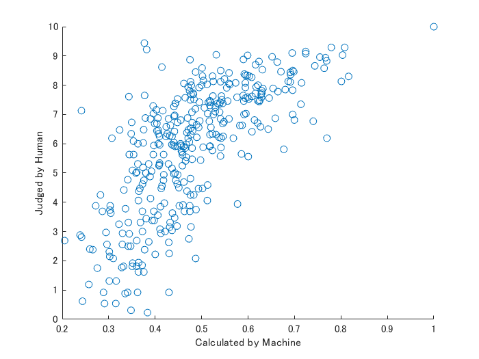
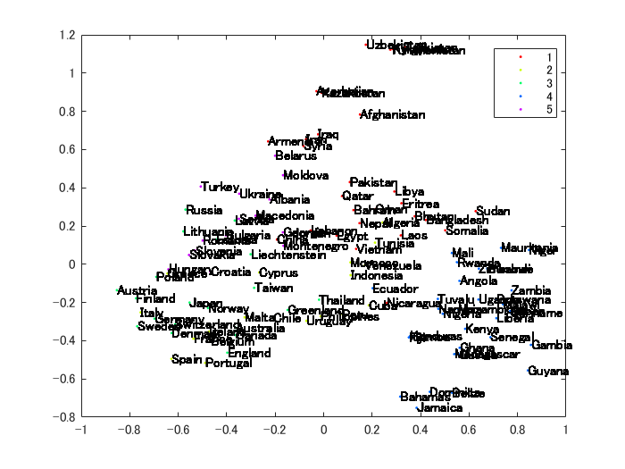
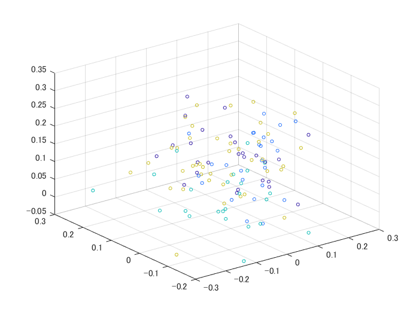
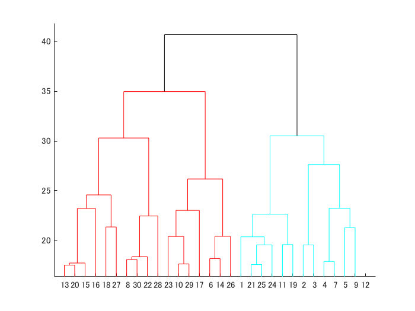
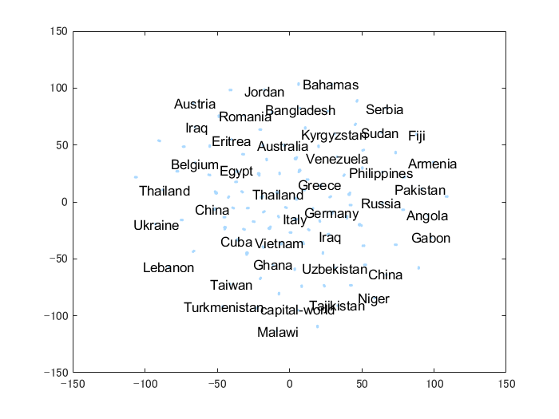

# 第7章: 単語ベクトル


単語の意味を実ベクトルで表現する単語ベクトル（単語埋め込み）に関して，以下の処理を行うプログラムを作成せよ．


# 60. 単語ベクトルの読み込みと表示


Google Newsデータセット（約1,000億単語）での[学習済み単語ベクトル](https://drive.google.com/file/d/0B7XkCwpI5KDYNlNUTTlSS21pQmM/edit?usp=sharing)（300万単語・フレーズ，300次元）をダウンロードし，”United States”の単語ベクトルを表示せよ．ただし，”United States”は内部的には”United_States”と表現されていることに注意せよ．


### 筆者コメント


お題の学習済み単語ベクトルは.bin形式ですが、MATLABではバイナリ形式の読み込みにはおそらく対応していないようです。回避策として、こちらの[bin→txtへの変換ツール](https://github.com/marekrei/convertvec)を使用し、[readWordEmbedding](https://jp.mathworks.com/help/textanalytics/ref/readwordembedding.html)関数で読み込む方法が考えられます。しかしながら筆者のPC環境ではメモリがいっぱいだったので、こちらは試さず、代わりにfacebook社のfasttextを読み込んで回答を進めます。


```matlab
emb = fastTextWordEmbedding
```
```
emb = 
  wordEmbedding のプロパティ:

     Dimension: 300
    Vocabulary: [1x999994 string]

```
```matlab
us = word2vec(emb,"UnitedStates")
```
```
us = 1x300 の single 行ベクトル    
   -0.0167   -0.0190    0.0781   -0.0053    0.0961    0.1369    0.0189   -0.0211    0.1841   -0.0189   -0.0759   -0.0131   -0.0369    0.0288   -0.0024   -0.0230   -0.1206   -0.0072   -0.0410    0.0173   -0.2277   -0.1710   -0.0553   -0.0047   -0.0067    0.0083    0.0084    0.1301   -0.0494    0.0261   -0.0077    0.0749    0.0274    0.0063    0.0427   -0.0074   -0.0344    0.1704    0.0510   -0.0149   -0.0054    0.0181   -0.0193    0.0312   -0.0260    0.0264    0.0123    0.1577   -0.0430   -0.0978

```
# 61. 単語の類似度


“United States”と”U.S.”のコサイン類似度を計算せよ．


### 筆者コメント


facebook社のfasttextに合わせて少し表現を変えています。


```matlab
d1 = word2vec(emb,"UnitedStates")
```
```
d1 = 1x300 の single 行ベクトル    
   -0.0167   -0.0190    0.0781   -0.0053    0.0961    0.1369    0.0189   -0.0211    0.1841   -0.0189   -0.0759   -0.0131   -0.0369    0.0288   -0.0024   -0.0230   -0.1206   -0.0072   -0.0410    0.0173   -0.2277   -0.1710   -0.0553   -0.0047   -0.0067    0.0083    0.0084    0.1301   -0.0494    0.0261   -0.0077    0.0749    0.0274    0.0063    0.0427   -0.0074   -0.0344    0.1704    0.0510   -0.0149   -0.0054    0.0181   -0.0193    0.0312   -0.0260    0.0264    0.0123    0.1577   -0.0430   -0.0978

```
```matlab
d2 = word2vec(emb,"US")
```
```
d2 = 1x300 の single 行ベクトル    
    0.0682    0.0611   -0.0201    0.2396    0.0144    0.0482    0.0809    0.0113   -0.0262   -0.0699    0.0097   -0.0617    0.0217    0.1519   -0.0246   -0.0030   -0.0190    0.0929    0.0106   -0.0467   -0.0916   -0.0720    0.0055   -0.1101    0.0290    0.0510    0.0252    0.1700    0.1396   -0.0970   -0.0366   -0.0715   -0.1103   -0.1130    0.2253    0.1986    0.0449    0.1159    0.0072   -0.0274   -0.1349   -0.0795   -0.0033   -0.0291    0.0023    0.1017   -0.0100   -0.0864   -0.1536   -0.1085

```
```matlab
dot(d1,d2)/(rssq(d1)*rssq(d2))
```
```
ans = 0.4555
```
# 62. 類似度の高い単語10件


“United States”とコサイン類似度が高い10語と，その類似度を出力せよ．


```matlab
[words,dist] = vec2word(emb,d1,10,'Distance','cosine')
```
```
words = 10x1 string    
"UnitedStates"         
"Kingdom-related"      
"statename"            
"doc1"                 
"America.svg"          
"States--"             
"state1"               
"Massachusetts.svg"    
"Judiciaries"          
"East-central"         

dist = 10x1 の single 列ベクトル    
         0
    0.4172
    0.4316
    0.4352
    0.4407
    0.4490
    0.4496
    0.4506
    0.4518
    0.4518

```
# 63. 加法構成性によるアナロジー


“Spain”の単語ベクトルから”Madrid”のベクトルを引き，”Athens”のベクトルを足したベクトルを計算し，そのベクトルと類似度の高い10語とその類似度を出力せよ．


```matlab
spain = word2vec(emb,"Spain");
madrid = word2vec(emb,"Madrid");
athens = word2vec(emb,"Athens");

[words,dist] = vec2word(emb, spain - madrid + athens ,10,'Distance','cosine')
```
```
words = 10x1 string    
"Athens"          
"Greece"          
"Georgia"         
"Italy"           
"Piraeus"         
"Crete"           
"Peloponnese"     
"Spain"           
"Acropolis"       
"Thessaloniki"    

dist = 10x1 の single 列ベクトル    
    0.2003
    0.2105
    0.4054
    0.4199
    0.4201
    0.4214
    0.4264
    0.4363
    0.4425
    0.4445

```
# 64. アナロジーデータでの実験


[単語アナロジーの評価データ](http://download.tensorflow.org/data/questions-words.txt)をダウンロードし，vec(2列目の単語) - vec(1列目の単語) + vec(3列目の単語)を計算し，そのベクトルと類似度が最も高い単語と，その類似度を求めよ．求めた単語と類似度は，各事例の末尾に追記せよ．


```matlab
url = 'http://download.tensorflow.org/data/questions-words.txt';
filename = 'questions-words.txt';
websave(filename,url);
```
```matlab
qwtable = readtable(filename,'ReadVariableNames',false);
qwtable.Properties.VariableNames = [{'Capital1'} {'Country1'} {'Capital2'} {'Country2'}]
```
| |Capital1|Country1|Capital2|Country2|
|:--:|:--:|:--:|:--:|:--:|
|1|'Athens'|'Greece'|'Baghdad'|'Iraq'|
|2|'Athens'|'Greece'|'Bangkok'|'Thailand'|
|3|'Athens'|'Greece'|'Beijing'|'China'|
|4|'Athens'|'Greece'|'Berlin'|'Germany'|
|5|'Athens'|'Greece'|'Bern'|'Switzerland'|
|6|'Athens'|'Greece'|'Cairo'|'Egypt'|
|7|'Athens'|'Greece'|'Canberra'|'Australia'|
|8|'Athens'|'Greece'|'Hanoi'|'Vietnam'|
|9|'Athens'|'Greece'|'Havana'|'Cuba'|
|10|'Athens'|'Greece'|'Helsinki'|'Finland'|
|11|'Athens'|'Greece'|'Islamabad'|'Pakistan'|
|12|'Athens'|'Greece'|'Kabul'|'Afghanistan'|
|13|'Athens'|'Greece'|'London'|'England'|
|14|'Athens'|'Greece'|'Madrid'|'Spain'|

```matlab
shuto1 = word2vec(emb,cellstr(qwtable.Capital1));
kuni1 = word2vec(emb,cellstr(qwtable.Country1));
shuto2 = word2vec(emb,cellstr(qwtable.Capital2));
```
```matlab
T = kuni1-shuto1+shuto2;
```
```matlab
[wordsvec,distvec] = vec2word(emb, T);
```
```matlab
W = array2table(wordsvec');
W.Properties.VariableNames = {'PredictedCountry'};
D = array2table(distvec');
D.Properties.VariableNames = {'Distance'};
qwtable = [qwtable W D];
```
```matlab
head(qwtable)
```
| |Capital1|Country1|Capital2|Country2|PredictedCountry|Distance|
|:--:|:--:|:--:|:--:|:--:|:--:|:--:|
|1|'Athens'|'Greece'|'Baghdad'|'Iraq'|"Baghdad"|0.1727|
|2|'Athens'|'Greece'|'Bangkok'|'Thailand'|"Thailand"|0.1563|
|3|'Athens'|'Greece'|'Beijing'|'China'|"China"|0.1774|
|4|'Athens'|'Greece'|'Berlin'|'Germany'|"Berlin"|0.1926|
|5|'Athens'|'Greece'|'Bern'|'Switzerland'|"Bern"|0.1666|
|6|'Athens'|'Greece'|'Cairo'|'Egypt'|"Cairo"|0.1725|
|7|'Athens'|'Greece'|'Canberra'|'Australia'|"Canberra"|0.1822|
|8|'Athens'|'Greece'|'Hanoi'|'Vietnam'|"Hanoi"|0.1507|

# 65. アナロジータスクでの正解率


64の実行結果を用い，意味的アナロジー（semantic analogy）と文法的アナロジー（syntactic analogy）の正解率を測定せよ．


```matlab

```
# 66. WordSimilarity-353での評価


[The WordSimilarity-353 Test Collection](http://www.gabrilovich.com/resources/data/wordsim353/wordsim353.html)の評価データをダウンロードし，単語ベクトルにより計算される類似度のランキングと，人間の類似度判定のランキングの間のスピアマン相関係数を計算せよ．


```matlab
wstable = readtable('combined.csv','PreserveVariableNames',true);
word1 = word2vec(emb,cellstr(wstable.("Word 1")));
word2 = word2vec(emb,cellstr(wstable.("Word 2")));
```
```matlab
wordveccorrelation = dot(word1',word2')./(rssq(word1').*rssq(word2'));
```
```matlab
scatter(wordveccorrelation,wstable.("Human (mean)"))
xlabel('Calculated by Machine')
ylabel('Judged by Human')
```



```matlab
[rho,pvalue] = corr(wordveccorrelation',wstable.("Human (mean)"),'Type','Spearman')
```
```
rho = 0.7333
pvalue = 0
```
# 67. k-meansクラスタリング


国名に関する単語ベクトルを抽出し，k-meansクラスタリングをクラスタ数k=5として実行せよ．


```matlab
k = 5;
grp = kmeans(kuni1(1:5031,:), k);
```
```
警告: 欠損データをもつ X の行を無視します。
```
```matlab
% 可視化用にPCA
[~,scrs,~,~,~] = pca(kuni1(1:5031,:));
```
```
警告: X の列は、マシンの精度内で線形従属しています。
最初の 115 成分だけを使用して TSQUARED を計算します。
```
```matlab
% 可視化
gscatter(scrs(:,1),scrs(:,2),grp)
text(double(scrs(:,1)),double(scrs(:,2)),qwtable.Country1(1:5031))
```



# 68. Ward法によるクラスタリング


国名に関する単語ベクトルに対し，Ward法による階層型クラスタリングを実行せよ．さらに，クラスタリング結果をデンドログラムとして可視化せよ．


```matlab
X = kuni1(1:5031,:);
Z = linkage(X,'ward');
T = cluster(Z,'maxclust',k);
cutoff = median([Z(end-2,3) Z(end-1,3)]);
scatter3(X(:,1),X(:,2),X(:,3),10,T)
```



```matlab
dendrogram(Z,'ColorThreshold',cutoff)
```



# 69. t-SNEによる可視化


国名に関する単語ベクトルのベクトル空間をt-SNEで可視化せよ．


```matlab
XY = tsne(X);
```
```
警告: X 内の NaN 欠損値をもつ行または 'InitialY' 値が削除されます。
警告: 最大反復回数に達しました: 二分探索の一部は最適値に収束しません。
```
```matlab
textscatter(XY,qwtable.Country1(1:5031))
```



