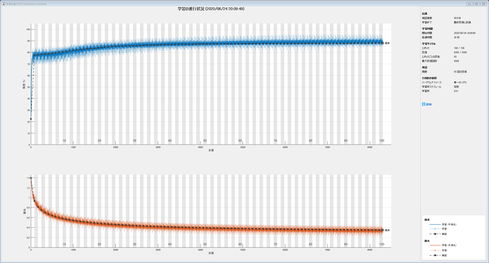

# 第8章: ニューラルネット

Copyright (c) 2020 NLP100-MATLAB

第6章で取り組んだニュース記事のカテゴリ分類を題材として，ニューラルネットワークでカテゴリ分類モデルを実装する．なお，この章ではPyTorch, TensorFlow, Chainerなどの機械学習プラットフォームを活用せよ．


  
# 70. 単語ベクトルの和による特徴量


問題50で構築した学習データ，検証データ，評価データを行列・ベクトルに変換したい．例えば，学習データについて，すべての事例の特徴ベクトルを並べた行列と，正解ラベルを並べた行列（ベクトル）を作成したい．


ここで，
は学習データの事例数であり，
と
はそれぞれ，
番目の事例の特徴量ベクトルと正解ラベルを表す．なお，今回は「ビジネス」「科学技術」「エンターテイメント」「健康」の4カテゴリ分類である．
で4未満の自然数（0を含む）を表すことにすれば，任意の事例の正解ラベル
は
で表現できる．以降では，ラベルの種類数を
で表す（今回の分類タスクでは
である）．


番目の事例の特徴ベクトルは，次式で求める．


ここで，
番目の事例は
個の（記事見出しの）単語列
から構成され，
は単語
に対応する単語ベクトル（次元数は
）である．すなわち，
番目の事例の記事見出しを，その見出しに含まれる単語のベクトルの平均で表現したものが
である．今回は単語ベクトルとして，問題60でダウンロードしたものを用いればよい．
次元の単語ベクトルを用いたので，
である．


番目の事例のラベルは，次のように定義する．


なお，カテゴリ名とラベルの番号が一対一で対応付いていれば，上式の通りの対応付けでなくてもよい．


以上の仕様に基づき，以下の行列・ベクトルを作成し，ファイルに保存せよ．


   \item{ 学習データの特徴量行列:  }
   \item{ 学習データのラベルベクトル: }
   \item{ 検証データの特徴量行列:  }
   \item{ 検証データのラベルベクトル:  }
   \item{ 評価データの特徴量行列:  }
   \item{ 評価データのラベルベクトル:  }


なお，はそれぞれ，学習データの事例数，検証データの事例数，評価データの事例数である**．**


  
## **問題50で保存したデータの読み込み**


問題50で保存したデータを読み込みます。


```matlab:Code
opt = detectImportOptions('train.txt');
opt = setvartype(opt,["categorical","string"]);

dataTrain = readtable('train.txt',opt);
dataValid = readtable('valid.txt',opt);
dataTest  = readtable('test.txt',opt);

```

## 単語ベクトルの読み込み


単語ベクトルを作成するためのWord2Vecモデルを読み込みます（学習済みモデルのファイルは同じフォルダにあるものと仮定しています）．読み込みにはバイナリ形式のword2vecファイルを読み込むための関数`readW2Vbin.m `を自前で作ったので、それを使っています．興味のある方は[MathWorks の FileExchange](https://jp.mathworks.com/matlabcentral/fileexchange/77272-matlab_word2vec_binary_reader) に上げてありますので，そちらをどうぞ．


```matlab:Code
emb = readW2Vbin('GoogleNews-vectors-negative300.bin');
```

## 形態素解析


特徴量を計算するために、形態素解析にかけましょう。


```matlab:Code
docsTrain = tokenizedDocument(dataTrain.Title);
docsValid = tokenizedDocument(dataValid.Title);
docsTest  = tokenizedDocument(dataTest.Title);

tknTrain = tokenDetails(docsTrain);
tknValid = tokenDetails(docsValid);
tknTest  = tokenDetails(docsTest);
```

## 特徴量の計算


特徴量を計算するためには、各文を構成する単語一つ一つについて、`word2vec` を適用する必要があります．そこで、まず`tokenDetails` を使って単語の一覧テーブルを生成します．そして，列`Token` に対して一括でword2vec を適用し，結果を新たな列 `vec` に格納します．文毎に平均をとるには，列 `DocumentNumber` をキーにして関数 `grpstats` を適用します．


```matlab:Code
tknTrain.vec = word2vec(emb,tknTrain.Token);
tknValid.vec = word2vec(emb,tknValid.Token);
tknTest.vec  = word2vec(emb,tknTest.Token);

XTrainTable = grpstats(tknTrain(:,[2 end]),'DocumentNumber');
XValidTable = grpstats(tknValid(:,[2 end]),'DocumentNumber');
XTestTable  = grpstats(tknTest(:,[2 end]),'DocumentNumber');

XTrain = XTrainTable.mean_vec;
XValid = XValidTable.mean_vec;
XTest  = XTestTable.mean_vec;
```

## ラベルベクトルの生成


MATLABでラベルデータを扱う場合は，Categorical配列として扱った方が楽な場合が多いので，作業としては読み込んだデータテーブルから該当する部分を抜きだすだけになります．


```matlab:Code
YTrain = dataTrain.Category;
YValid = dataValid.Category;
YTest  = dataTest.Category;
```


どうしてもベクトル化したいならば，すでに付いている文字列のラベルを数値に変換すればよいので，これも簡単です．各データに含まれている`Category`列（b, t, e, m のいずれかの値をとる）をChar 型に変換して文字行列を作成し，その文字行列の各行と文字列`'btem'`とを比較します．比較の結果は，Category列 と同じ行数で４列の論理配列になります．これは，ラベルデータのOne-Hot表現ともよばれる表現方法ですね．


```matlab:Code
TTrain = char(dataTrain.Category)=='btem';
TValid = char(dataValid.Category)=='btem';
TTest  = char(dataTest.Category) =='btem'
```


```text:Output
TTest = 1334x4 の logical 配列    
   1   0   0   0
   1   0   0   0
   1   0   0   0
   1   0   0   0
   1   0   0   0
   1   0   0   0
   1   0   0   0
   1   0   0   0
   0   0   1   0
   0   0   1   0

```


この配列に対して`find`を適用すると，該当するカテゴリーの線形インデックスが得られます．得られた線形インデックスを，通常の行列の添え字形式に変換してその第二成分をとることで，ラベルベクトルになります．


```matlab:Code
[~,YTrainVec] = ind2sub([height(dataTrain) 4],find(TTrain));
[~,YValidVec] = ind2sub([height(dataValid) 4],find(TValid));
[~,YTestVec ] = ind2sub([height(dataTest) 4], find(TTest))
```


```text:Output
YTestVec = 1334x1    
     1
     1
     1
     1
     1
     1
     1
     1
     1
     1

```

# 71. 単層ニューラルネットワークによる予測


問題70で保存した行列を読み込み，学習データについて以下の計算を実行せよ．


ただし，はソフトマックス関数，は特徴ベクトルを縦に並べた行列である．


行列は単層ニューラルネットワークの重み行列で，ここではランダムな値で初期化すればよい（問題73以降で学習して求める）．なお，は未学習の行列で事例を分類したときに，各カテゴリに属する確率を表すベクトルである． 同様に，は，学習データの事例について，各カテゴリに属する確率を行列として表現している．


\matlabheadingtwo{の定義}


word2vec モデルからモデル次元,学習データからカテゴリー数を取得して，行列を生成します．


```matlab:Code
inputSize = emb.Dimension;
numClasses = numel( categories(dataTrain.Category));
W = rand([inputSize, numClasses]);
```

\matlabheadingtwo{の計算}


数式の通りに記述するだけ，と言いたいのですが一つだけ注意が必要です．一般に機械学習ではデータの行列は行が観測，列が特徴量に対応していますが，深層学習ではそれが逆になります．MATLABの関数の実装も概ねこの原理に従っていますので，`softmax`関数の入力はを転置したものになります．結果の確率ベクトルを行ベクトルにするためには，さらに`softmax`関数の計算結果をもう一度転置する必要があります．


```matlab:Code
Yhat = softmax((XTrain(1:4,:)*W)')'
```


```text:Output
Yhat = 4x4 の single 行列    
    0.2863    0.2195    0.2776    0.2165
    0.4017    0.1729    0.1647    0.2607
    0.2441    0.1912    0.2021    0.3626
    0.3929    0.2097    0.2409    0.1566

```

\matlabheadingtwo{の計算}


の計算ができていれば，単一の事例に対する計算結果は対応する行を抜き出すだけです．


```matlab:Code
yhat_1 = Yhat(1,:)
```


```text:Output
yhat_1 = 1x4 の single 行ベクトル    
    0.2863    0.2195    0.2776    0.2165

```

# 72. 損失と勾配の計算


学習データの事例と事例集合に対して，クロスエントロピー損失と，行列に対する勾配を計算せよ．なお，ある事例に対して損失は次式で計算される．


ただし，事例集合に対するクロスエントロピー損失は，その集合に含まれる各事例の損失の平均とする．


## ちょっとした手計算


クロスエントロピー損失と勾配については，ラベルデータをOne-Hot表現で表現すると扱いが楽になります．事例集合全体の損失関数をとすると，


 


となります．また，行列に対する勾配は次のようにかけます．


 


これを実装すると次のようになります．あってるかな？


```matlab:Code
Yhat = softmax((XTrain*W)')';

L = -sum(sum(TTrain.*log(Yhat)))
```


```text:Output
L = 1.5060e+04
```


```matlab:Code
dLdW = -XTrain'*(TTrain-Yhat)
```


```text:Output
dLdW = 300x4 の single 行列    
   23.0598   -3.0855 -118.0084   98.0341
  -39.3303   13.8832  -53.9515   79.3985
   21.0242  -38.0043  128.0468 -111.0667
 -110.2795   38.3179   -3.8562   75.8178
   60.7615   17.1151  -72.9147   -4.9619
   56.3110  -36.3838  -21.5720    1.6448
   15.8674  -34.8244   60.4932  -41.5362
   22.8266  -77.9163  189.9676 -134.8779
 -208.1470   53.7098  -51.3764  205.8136
 -118.0010   18.3425  -85.6335  185.2921

```

# 73. 確率的勾配降下法による学習


確率的勾配降下法（SGD: Stochastic Gradient Descent）を用いて，行列を学習せよ．なお，学習は適当な基準で終了させればよい（例えば「100エポックで終了」など）．


## ニューラルネットの定義


問題73以降では手を抜きます．というのも，MATLABのDeepLearning Toolbox では重み行列・損失関数・勾配は内部で自動的に計算してくれるので直接扱うことはほとんどないからです．ここでは，今考えている問題をネットワークオブジェクトとして定義して学習を行います．ここまでの内容から，ネットワークは入力層，全結合層（重み行列に相当），ソフトマックス層，分類出力層（交差エントロピー損失の計算に相当）の4層で構成されることになります．


Deep Learning Toolbox では，画像・シーケンスデータ両方を扱うことができますが，この例題の場合には，サイズが300×1のグレースケール画像（チャンネル数1）として扱うことにします．


```matlab:Code
layers = [ ...
  imageInputLayer([300 1 1],"Name","Input","Normalization","none"); % 入力層
  fullyConnectedLayer(numClasses,"Name","FC"); ...  % 全結合層
  softmaxLayer; ...       % ソフトマックス層
  classificationLayer ... % 分類出力層
  ];
```


また，学習・検証・評価データについて，各事例のサイズを300×1×1に変換します．


```matlab:Code
nTrain = size(XTrain,1);
nValid = size(XValid,1);
nTest  = size(XTest, 1);

XpTrain = reshape(XTrain',[inputSize 1 1 nTrain]);
XpValid = reshape(XValid',[inputSize 1 1 nValid]);
XpTest  = reshape(XTest', [inputSize 1 1 nTest ]);
```


ネットワークの学習については，学習アルゴリズムとしてSGDを，最大エポック数を100として，あとはデフォルト値を使ってみます．それから，後のほうで「GPUを使うようにコードを改変せよ」とのお題があるので，あえてCPUで計算させるオプションを設定します．また，ここではミニバッチは使用しないので，MiniBatchSize オプションを全事例数とします．


```matlab:Code
options = trainingOptions('sgdm','MaxEpochs',100,"ExecutionEnvironment","cpu","MiniBatchSize",nTrain);

netInit = trainNetwork(XpTrain,YTrain,layers,options);
```


```text:Output
｜＝＝＝＝＝＝＝＝＝＝＝＝＝＝＝＝＝＝＝＝＝＝＝＝＝＝＝＝＝＝＝＝＝＝＝＝＝＝＝＝＝＝＝＝＝＝＝＝＝＝＝＝＝＝＝＝＝＝＝＝＝＝＝＝＝｜
｜　　エポック　　｜　　反復　　｜　　　　　経過時間　　　　　｜　　ミニバッチの精度　　｜　　ミニバッチ損失　　｜　　基本学習率　　｜
｜　　　　　　　　｜　　　　　　｜　　（ｈｈ：ｍｍ：ｓｓ）　　｜　　　　　　　　　　　　｜　　　　　　　　　　　｜　　　　　　　　　｜
｜＝＝＝＝＝＝＝＝＝＝＝＝＝＝＝＝＝＝＝＝＝＝＝＝＝＝＝＝＝＝＝＝＝＝＝＝＝＝＝＝＝＝＝＝＝＝＝＝＝＝＝＝＝＝＝＝＝＝＝＝＝＝＝＝＝｜
｜　　　　　　１　｜　　　　１　｜　　　　　００：００：００　｜　　　　　２１．２４％　｜　　　　１．３８５３　｜　　０．０１００　｜
｜　　　　　５０　｜　　　５０　｜　　　　　００：００：０１　｜　　　　　７６．１９％　｜　　　　１．０４９０　｜　　０．０１００　｜
｜　　　　１００　｜　　１００　｜　　　　　００：００：０１　｜　　　　　７７．３９％　｜　　　　０．９３１１　｜　　０．０１００　｜
｜＝＝＝＝＝＝＝＝＝＝＝＝＝＝＝＝＝＝＝＝＝＝＝＝＝＝＝＝＝＝＝＝＝＝＝＝＝＝＝＝＝＝＝＝＝＝＝＝＝＝＝＝＝＝＝＝＝＝＝＝＝＝＝＝＝｜
```

# 74. 正解率の計測


問題73で求めた行列を用いて学習データおよび評価データの事例を分類したとき，その正解率をそれぞれ求めよ．


これは簡単．


```matlab:Code
predResub = classify(netInit,XpTrain);
okRatioResub = nnz(predResub == YTrain)/numel(predResub)
```


```text:Output
okRatioResub = 0.7739
```


```matlab:Code
predTest  = classify(netInit,XpTest);
okRatioTest = nnz(predTest == YTest)/numel(predTest)
```


```text:Output
okRatioTest = 0.7744
```

# 75. 損失と正解率のプロット


問題73のコードを改変し，各エポックのパラメータ更新が完了するたびに，訓練データでの損失，正解率，検証データでの損失，正解率をグラフにプロットし，学習の進捗状況を確認できるようにせよ．


## 学習パラメータの設定


これらのことは学習オプションのパラメータ値を調整することで実現できます．まず，学習オプションの`"Plot"`プロパティを `"training-progress"` にすれば，学習中の状況を表示してくれます．また，プロパティ`"ValidationData"`に検証用データと検証用ラベルデータをセル配列として与えることで検証データの設定ができます．また，`"ValidationFrequency"` で検証頻度が設定できます．


```matlab:Code
options = trainingOptions('sgdm','MaxEpochs',100,'MiniBatchSize',nTrain, ...
  "ExecutionEnvironment","cpu", ...
  "Plots","training-progress", ... 
  "ValidationData",{XpValid,YValid}, ...
  "ValidationFrequency",10);

net0 = trainNetwork(XpTrain,YTrain,layers, options); 
```


```text:Output
｜＝＝＝＝＝＝＝＝＝＝＝＝＝＝＝＝＝＝＝＝＝＝＝＝＝＝＝＝＝＝＝＝＝＝＝＝＝＝＝＝＝＝＝＝＝＝＝＝＝＝＝＝＝＝＝＝＝＝＝＝＝＝＝＝＝＝＝＝＝＝＝＝＝＝＝＝＝＝＝＝＝＝＝｜
｜　　エポック　　｜　　反復　　｜　　　　　経過時間　　　　　｜　　ミニバッチの精度　　｜　　検証精度　　｜　　ミニバッチ損失　　｜　　検証損失　　｜　　基本学習率　　｜
｜　　　　　　　　｜　　　　　　｜　　（ｈｈ：ｍｍ：ｓｓ）　　｜　　　　　　　　　　　　｜　　　　　　　　｜　　　　　　　　　　　｜　　　　　　　　｜　　　　　　　　　｜
｜＝＝＝＝＝＝＝＝＝＝＝＝＝＝＝＝＝＝＝＝＝＝＝＝＝＝＝＝＝＝＝＝＝＝＝＝＝＝＝＝＝＝＝＝＝＝＝＝＝＝＝＝＝＝＝＝＝＝＝＝＝＝＝＝＝＝＝＝＝＝＝＝＝＝＝＝＝＝＝＝＝＝＝｜
｜　　　　　　１　｜　　　　１　｜　　　　　００：００：００　｜　　　　　２０．３１％　｜　２１．２９％　｜　　　　１．４０４９　｜　１．３９７４　｜　　０．０１００　｜
｜　　　　　１０　｜　　　１０　｜　　　　　００：００：０１　｜　　　　　３２．４３％　｜　３６．８８％　｜　　　　１．３４０１　｜　１．３２０４　｜　　０．０１００　｜
｜　　　　　２０　｜　　　２０　｜　　　　　００：００：０１　｜　　　　　５２．４８％　｜　５６．８２％　｜　　　　１．２３３１　｜　１．２０９２　｜　　０．０１００　｜
｜　　　　　３０　｜　　　３０　｜　　　　　００：００：０１　｜　　　　　６６．４３％　｜　６８．８２％　｜　　　　１．１５３０　｜　１．１２７６　｜　　０．０１００　｜
｜　　　　　４０　｜　　　４０　｜　　　　　００：００：０１　｜　　　　　７１．９８％　｜　７２．７９％　｜　　　　１．０９９６　｜　１．０７３２　｜　　０．０１００　｜
｜　　　　　５０　｜　　　５０　｜　　　　　００：００：０１　｜　　　　　７４．５３％　｜　７５．１９％　｜　　　　１．０６１０　｜　１．０３４３　｜　　０．０１００　｜
｜　　　　　６０　｜　　　６０　｜　　　　　００：００：０２　｜　　　　　７５．８２％　｜　７６．４６％　｜　　　　１．０３０２　｜　１．００３５　｜　　０．０１００　｜
｜　　　　　７０　｜　　　７０　｜　　　　　００：００：０２　｜　　　　　７６．４０％　｜　７７．０６％　｜　　　　１．００３７　｜　０．９７７６　｜　　０．０１００　｜
｜　　　　　８０　｜　　　８０　｜　　　　　００：００：０２　｜　　　　　７６．７２％　｜　７７．２９％　｜　　　　０．９８０２　｜　０．９５４８　｜　　０．０１００　｜
｜　　　　　９０　｜　　　９０　｜　　　　　００：００：０２　｜　　　　　７６．８６％　｜　７７．２１％　｜　　　　０．９５９０　｜　０．９３４４　｜　　０．０１００　｜
｜　　　　１００　｜　　１００　｜　　　　　００：００：０３　｜　　　　　７６．９１％　｜　７７．３６％　｜　　　　０．９３９６　｜　０．９１５８　｜　　０．０１００　｜
｜＝＝＝＝＝＝＝＝＝＝＝＝＝＝＝＝＝＝＝＝＝＝＝＝＝＝＝＝＝＝＝＝＝＝＝＝＝＝＝＝＝＝＝＝＝＝＝＝＝＝＝＝＝＝＝＝＝＝＝＝＝＝＝＝＝＝＝＝＝＝＝＝＝＝＝＝＝＝＝＝＝＝＝｜
```


# 76. チェックポイント


問題75のコードを改変し，各エポックのパラメータ更新が完了するたびに，チェックポイント（学習途中のパラメータ（重み行列など）の値や最適化アルゴリズムの内部状態）をファイルに書き出せ．


## 学習パラメータの設定


これも簡単で，学習オプションの CheckpointPath プロパティにチェックぽいのとファイルを保存するフォルダ名をセットすれば，各エポック毎にチェックポイントを.mat ファイルに保存してくれます．


```matlab:Code
options = trainingOptions('sgdm','MaxEpochs',100,'MiniBatchSize',nTrain, ...
  "ExecutionEnvironment","cpu", ...
  "Plots","training-progress", ... 
  "ValidationData",{XpValid,YValid}, ...
  "ValidationFrequency",10, ...
  "CheckpointPath",pwd);
```

  

```matlab:Code
net1 = trainNetwork(XpTrain,YTrain,layers,options);
```


```text:Output
｜＝＝＝＝＝＝＝＝＝＝＝＝＝＝＝＝＝＝＝＝＝＝＝＝＝＝＝＝＝＝＝＝＝＝＝＝＝＝＝＝＝＝＝＝＝＝＝＝＝＝＝＝＝＝＝＝＝＝＝＝＝＝＝＝＝＝＝＝＝＝＝＝＝＝＝＝＝＝＝＝＝＝＝｜
｜　　エポック　　｜　　反復　　｜　　　　　経過時間　　　　　｜　　ミニバッチの精度　　｜　　検証精度　　｜　　ミニバッチ損失　　｜　　検証損失　　｜　　基本学習率　　｜
｜　　　　　　　　｜　　　　　　｜　　（ｈｈ：ｍｍ：ｓｓ）　　｜　　　　　　　　　　　　｜　　　　　　　　｜　　　　　　　　　　　｜　　　　　　　　｜　　　　　　　　　｜
｜＝＝＝＝＝＝＝＝＝＝＝＝＝＝＝＝＝＝＝＝＝＝＝＝＝＝＝＝＝＝＝＝＝＝＝＝＝＝＝＝＝＝＝＝＝＝＝＝＝＝＝＝＝＝＝＝＝＝＝＝＝＝＝＝＝＝＝＝＝＝＝＝＝＝＝＝＝＝＝＝＝＝＝｜
｜　　　　　　１　｜　　　　１　｜　　　　　００：００：００　｜　　　　　２３．６６％　｜　２５．６４％　｜　　　　１．４０３５　｜　１．４００７　｜　　０．０１００　｜
｜　　　　　１０　｜　　　１０　｜　　　　　００：００：０１　｜　　　　　４４．４２％　｜　４６．７０％　｜　　　　１．３３５０　｜　１．３１９７　｜　　０．０１００　｜
｜　　　　　２０　｜　　　２０　｜　　　　　００：００：０１　｜　　　　　５７．１６％　｜　５８．１７％　｜　　　　１．２２３４　｜　１．２０４４　｜　　０．０１００　｜
｜　　　　　３０　｜　　　３０　｜　　　　　００：００：０１　｜　　　　　６５．１７％　｜　６５．１４％　｜　　　　１．１４１９　｜　１．１２１７　｜　　０．０１００　｜
｜　　　　　４０　｜　　　４０　｜　　　　　００：００：０２　｜　　　　　７０．１０％　｜　７０．６１％　｜　　　　１．０８８９　｜　１．０６８０　｜　　０．０１００　｜
｜　　　　　５０　｜　　　５０　｜　　　　　００：００：０２　｜　　　　　７３．０９％　｜　７２．６４％　｜　　　　１．０５１７　｜　１．０３０４　｜　　０．０１００　｜
｜　　　　　６０　｜　　　６０　｜　　　　　００：００：０３　｜　　　　　７４．５７％　｜　７４．３６％　｜　　　　１．０２２４　｜　１．００１０　｜　　０．０１００　｜
｜　　　　　７０　｜　　　７０　｜　　　　　００：００：０３　｜　　　　　７５．４８％　｜　７５．８６％　｜　　　　０．９９７４　｜　０．９７６３　｜　　０．０１００　｜
｜　　　　　８０　｜　　　８０　｜　　　　　００：００：０４　｜　　　　　７５．９２％　｜　７６．５４％　｜　　　　０．９７５２　｜　０．９５４６　｜　　０．０１００　｜
｜　　　　　９０　｜　　　９０　｜　　　　　００：００：０４　｜　　　　　７６．２６％　｜　７６．７６％　｜　　　　０．９５５１　｜　０．９３５１　｜　　０．０１００　｜
｜　　　　１００　｜　　１００　｜　　　　　００：００：０５　｜　　　　　７６．５４％　｜　７７．２９％　｜　　　　０．９３６７　｜　０．９１７４　｜　　０．０１００　｜
｜＝＝＝＝＝＝＝＝＝＝＝＝＝＝＝＝＝＝＝＝＝＝＝＝＝＝＝＝＝＝＝＝＝＝＝＝＝＝＝＝＝＝＝＝＝＝＝＝＝＝＝＝＝＝＝＝＝＝＝＝＝＝＝＝＝＝＝＝＝＝＝＝＝＝＝＝＝＝＝＝＝＝＝｜
```


# 77. ミニバッチ化


問題76のコードを改変し，事例ごとに損失・勾配を計算し，行列の値を更新せよ（ミニバッチ化）．の値をと変化させながら，1エポックの学習に要する時間を比較せよ．


ミニバッチのサイズを振ってループを回せば良いのですね．


```matlab:Code
miniBatchSize = [64 128 256 512];
elapsedTime   = zeros(size(miniBatchSize));
net2 = cell(size(miniBatchSize));

options = trainingOptions('sgdm','MaxEpochs',100, ...
  "ExecutionEnvironment","cpu", ...
  "Plots","training-progress", ... 
  "ValidationData",{XpValid,YValid}, ...
  "Verbose",false);

for kk = 1:length(miniBatchSize)
  options.MiniBatchSize = miniBatchSize(kk);
  options.ValidationFrequency = floor(nTrain/miniBatchSize(kk));
  tic
  net2{kk} = trainNetwork(XpTrain,YTrain,layers,options);
  elapsedTime(kk) = toc;
  
end
```





# 78. GPU上での学習


問題77のコードを改変し，GPU上で学習を実行せよ．


## 学習パラメータの設定


これも学習オプションのプロパティ値を変更すれば良いだけです．"ExecutionEnvironment"の値を"gpu"に変えるだけ．


```matlab:Code
options = trainingOptions('sgdm','MaxEpochs',100, ...
  "MiniBatchSize",256, ...
  "ExecutionEnvironment","gpu", ...
  "Plots","training-progress", ... 
  "ValidationData",{XpValid,YValid}, ...
  "ValidationFrequency",20, ...
  "Verbose",false);

net3 = trainNetwork(XpTrain,YTrain,layers,options); 
```


# 79. 多層ニューラルネットワーク


問題78のコードを改変し，バイアス項の導入や多層化など，ニューラルネットワークの形状を変更しながら，高性能なカテゴリ分類器を構築せよ．


間に適当に２層入れて順々に絞ってゆくような作りにしてみます（単なる思いつき）．


```matlab:Code
layers = [ ...
  imageInputLayer([inputSize 1 1],"Name","Input"); ... % 入力層
  fullyConnectedLayer(128,"Name","FC1"); ...
  tanhLayer; ...
  fullyConnectedLayer(32,"Name","FC2"); ...
  reluLayer; ...
  fullyConnectedLayer(8,"Name","FC3"); ...
  reluLayer; ...
  fullyConnectedLayer(numClasses,"Name","FC4"); ...
  softmaxLayer; ...       % ソフトマックス層
  classificationLayer ... % 分類出力層
  ];

MiniBatchSize = 500;
MaxEpochs = floor(MiniBatchSize/4);

options = trainingOptions('sgdm','MaxEpochs',MaxEpochs, ...
  "MiniBatchSize", MiniBatchSize, ...
  "ExecutionEnvironment","gpu", ...
  "Plots","training-progress", ... 
  "ValidationData",{XpValid,YValid}, ...
  "ValidationFrequency",floor(nTrain/MiniBatchSize), ...
  "Verbose",false, ...
  "Shuffle","every-epoch", ...
  "LearnRateSchedule","piecewise", ...
  "LearnRateDropPeriod",10, ...
  "LearnRateDropFactor",0.8, ...
  "InitialLearnRate",0.02, ...
  "L2Regularization",0.005, ...
  "Momentum",0.95);

net4 = trainNetwork(XpTrain,YTrain,layers,options); 
```


```matlab:Code
predTest  = classify(net4,XpTest);
okRatioTestNew = nnz(predTest == YTest)/numel(predTest)
```


```text:Output
okRatioTestNew = 0.8951
```


他にもいろいろやってみましたが，検証精度で90％程度が限界っぽいです．


```matlab:Code

```

