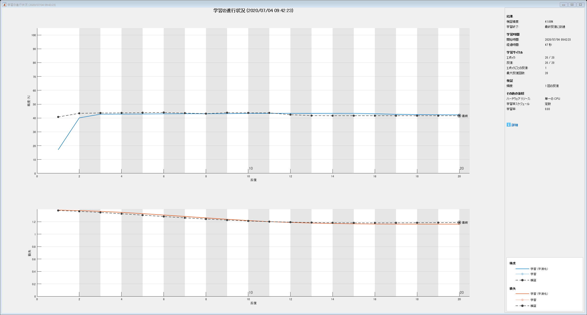
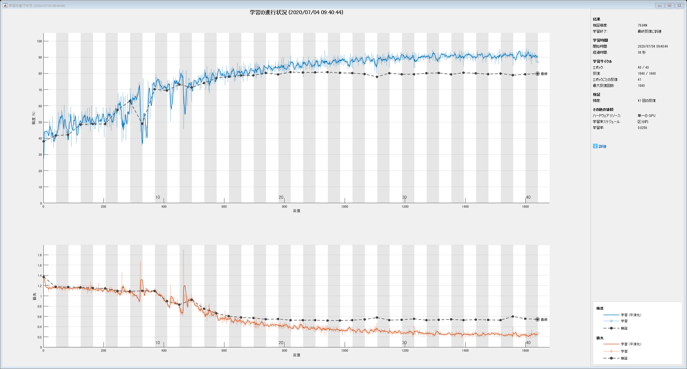
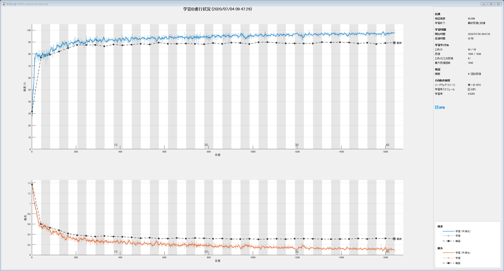
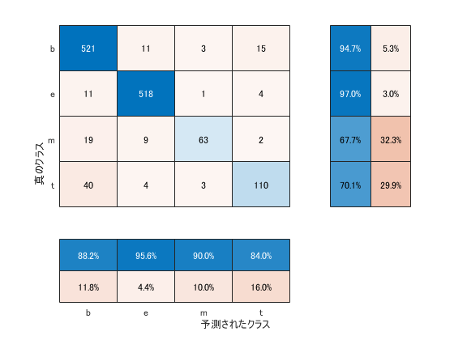
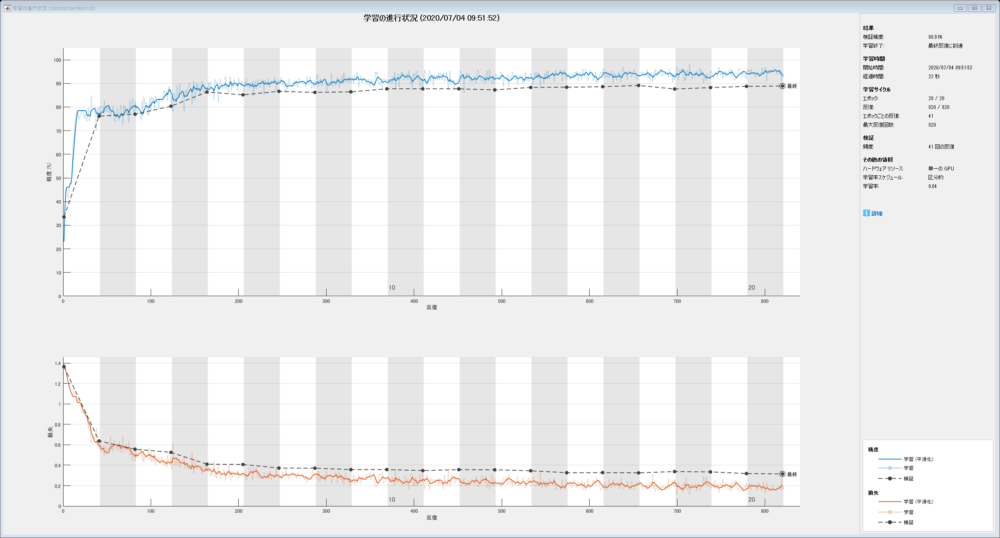
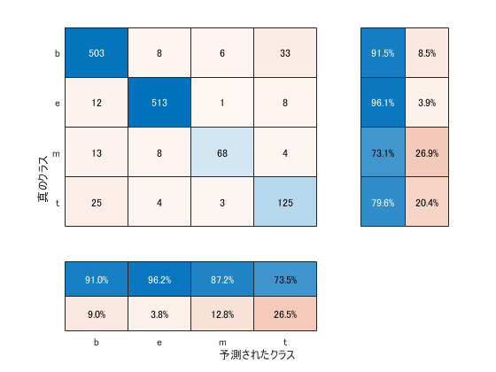
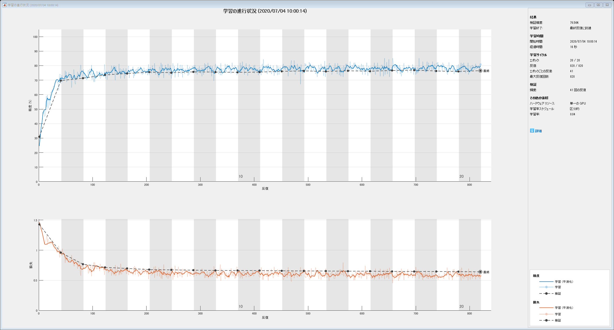
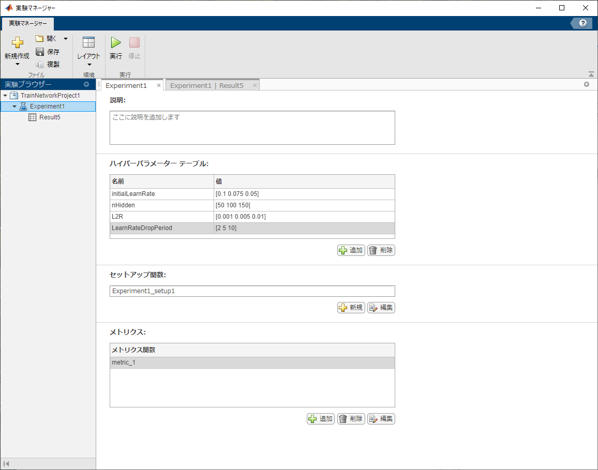
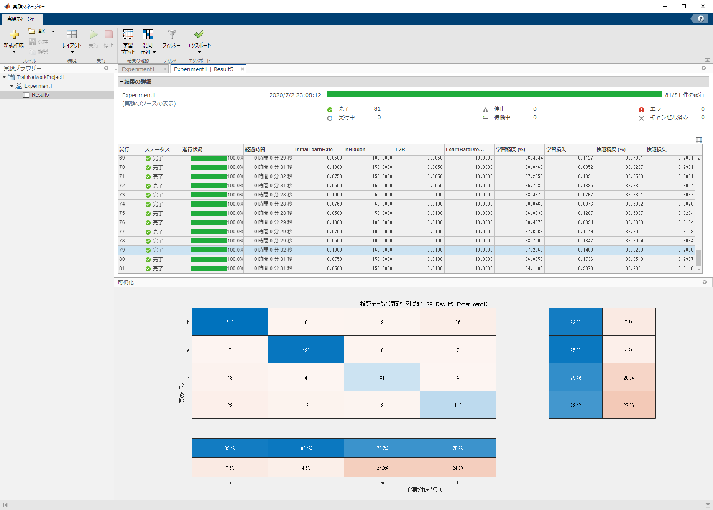

# 第9章: RNN, CNN（80－88）
# 80. ID番号への変換


> 問題51で構築した学習データ中の単語にユニークなID番号を付与したい．学習データ中で最も頻出する単語に`1`，2番目に頻出する単語に`2`，……といった方法で，学習データ中で2回以上出現する単語にID番号を付与せよ．そして，与えられた単語列に対して，ID番号の列を返す関数を実装せよ．ただし，出現頻度が2回未満の単語のID番号はすべて`0`とせよ．


問題51で構築した学習データとありますが，問題51のお題は特徴量設計でしたので，人によっては単語情報は破棄してしまっているかもしれません．そこで，ここでは問題50で作成したデータファイルから出発します．（データファイル `train.txt` がMATLAB path 上にあるとします．）


まず，学習データを読み込みます．


```matlab:Code
dataTbl = readtable('train.txt');
```


前処理として，形態素解析，StopWords（主に冠詞・前置詞などの機能語）の削除，原形への変換，句読点との削除，極端に短い語・長い語の削除を行います．（原形への変換は，あとでword2vecを使う時にうまくないのでここでは行いません．）


```matlab:Code
str = dataTbl.Title;
docs = tokenizedDocument(str);       
docs = addPartOfSpeechDetails(docs);
docs = removeStopWords(docs);
% docs = normalizeWords(docs);
docs = erasePunctuation(docs);
docs = removeShortWords(docs,2);
docs = removeLongWords(docs,15);
```


単語を頻度順にソートして，IDを付与する（エンコードする）には，wordEncoding を使うと便利です．ただし，出現頻度でエンコード対象単語を絞ることはできませんので，bagOfWords モデルを生成して．上位何語をエンコードするかを決めておきます．


```matlab:Code
bows = bagOfWords(docs);
nWordsToEncode = nnz(sum(bows.Counts)>1);

enc = wordEncoding(docs,'Order','Frequency','MaxNumWords',nWordsToEncode);

str = ["America","China","world"];
wordID = word2ind(enc,str);
disp(wordID);
```


```text:Output
    37     5   391
```


単語列からID列への変換関数は次のようになりました．


```matlab:Code(Display)
function wordID = word2ID(enc,words)

% 入力引数のチェック
arguments
  enc wordEncoding
  words (1,:) string
end

wordID = zeros(size(words)); % 返値を0で初期化しておきます

% 入力単語が入力されたエンコードされているかどうかを確認します．
lidxWordInEnc = isVocabularyWord(enc,words); 

% Keyに登録されている単語に対して，エンコードされたIDを取得します．
tmpStr = words(lidxWordInEnc); % 
tmpID  = word2ind(enc,tmpStr);

% 出力を抽出したIDで置き換えます．（エンコードされていない単語に対しては0のままになります．）
wordID(lidxWordInEnc)=tmpID;

end
```


下の例で，`"hogehoge"`はエンコードされていない単語，`"panda"` は出現回数が１回だけの単語の例です．


```matlab:Code
str = ["America","China","hogehoge","world","panda"];
wordID = word2ID(enc,str);
disp(wordID);
```


```text:Output
    37     5     0   391     0
```

  


で・も・ね・・・　学習データに対してエンコードしたIDを求めたいなら，次の１行で一発なのですね．


```matlab:Code
wordID = doc2sequence(enc,docs);
disp(wordID{1});
```


```text:Output
  1 列から 12 列

           0           0           0           0           0           0           0           0           0           0           0           0

  13 列から 24 列

           0           0           0           0           0           0           0           0           0           0           0           0

  25 列から 36 列

           0           0           0           0           0           0           0           0           0           0           0           0

  37 列から 48 列

           0           0           0           0           0           0           0           0           0           0           0           0

  49 列から 60 列

           0           0           0           0           0           0           0           0           0           0           0           0

  61 列から 68 列

           0           0           0         105        1399        1146        3793        2262
```


ただし，全ての文書に対するシーケンス長を揃えるために，ゼロパディングを行っているのと，エンコードされてない語は無視されることには気をつける必要があります．各文書の単語数を調べてみると，一番長いのが111単語の文で，第二位が13語の文になっています．


```matlab:Code
docs(doclength(docs)>13)
```


```text:Output
ans = 
  tokenizedDocument:

   111 tokens: Best Reactions Supposed Video Solange Knowles Jay HipHopDX 1399983366398 210714 Report JayZ attacked Beyonce sister icmp WSB Atlanta www.wsbtv.com 1399983366584 210715 Drunk Love Cent Reacts Beyonce Defending Jay 1399983366926 210716 Brawl Find Happened AfterParty Sparked Radar Online 1399983367118 210717 Sure Solange Attack Memes Funny Completely Crushable 1399983367406 210718 Cent Dame Dash Throw Jabs Jay Solange Fight VIDEO 1399983367691 210719 Fox unveils schedule cutting back Idol Hudson HubTimes 1399985294553 210720 Fox lineup American Idol shrinking Batman prequel Gotham air Mondays Newsday 1399985294870 210721 American Idol Set Cut Down Single Two Hour Show Week 1399985295162 210722 Fox Upfront Scorecard Big Risks Dig Big Hole Variety variety.com 1399985295432 210723 Riddler Joker Confirmed Fox Gotham

```


```matlab:Code
docs(doclength(docs)>12)
```


```text:Output
ans = 
  2x1 tokenizedDocument:

    111 tokens: Best Reactions Supposed Video Solange Knowles Jay HipHopDX 1399983366398 210714 Report JayZ attacked Beyonce sister icmp WSB Atlanta www.wsbtv.com 1399983366584 210715 Drunk Love Cent Reacts Beyonce Defending Jay 1399983366926 210716 Brawl Find Happened AfterParty Sparked Radar Online 1399983367118 210717 Sure Solange Attack Memes Funny Completely Crushable 1399983367406 210718 Cent Dame Dash Throw Jabs Jay Solange Fight VIDEO 1399983367691 210719 Fox unveils schedule cutting back Idol Hudson HubTimes 1399985294553 210720 Fox lineup American Idol shrinking Batman prequel Gotham air Mondays Newsday 1399985294870 210721 American Idol Set Cut Down Single Two Hour Show Week 1399985295162 210722 Fox Upfront Scorecard Big Risks Dig Big Hole Variety variety.com 1399985295432 210723 Riddler Joker Confirmed Fox Gotham
     13 tokens: Tesla boss Elon Musk gives away firm electric car secrets bid boost market

```


111語の文は非常に特殊なケースなので，シーケンスの長さを13に設定するのには無理はないと考えられます．


```matlab:Code
wordID = doc2sequence(enc,docs,"Length",13);

```


ここまでのプロセスを，サポート関数 `preprocess` としてまとめました．この関数を使って，検証データ，評価データについても同じようにIDのシーケンスを求めておきます．


```matlab:Code(Display)
function [wordID,enc] = preprocess(dataTbl,enc)

str = dataTbl.Title;
docs = tokenizedDocument(str);       
docs = addPartOfSpeechDetails(docs);
docs = removeStopWords(docs);
docs = normalizeWords(docs);
docs = erasePunctuation(docs);
docs = removeShortWords(docs,2);
docs = removeLongWords(docs,15);

bows = bagOfWords(docs);

nWordsToEncode = nnz(sum(bows.Counts)>1);

if nargin < 2
  enc = wordEncoding(docs,'Order','Frequency','MaxNumWords',nWordsToEncode);
end
wordID = doc2sequence(enc,docs,"Length",13);

end
```


```matlab:Code
trainTbl = readtable('train.txt');
[XTrain, enc] = preprocess(trainTbl);
YTrain = categorical(trainTbl.Category);

testTbl = readtable('test.txt');
XTest  = preprocess(testTbl,enc);
YTest  = categorical(testTbl.Category);

validTbl = readtable('valid.txt');
XValid  = preprocess(validTbl,enc);
YValid  = categorical(validTbl.Category);
```

# 81. RNNによる予測


ID番号で表現された単語列がある．ただし，は単語列の長さ，は単語のID番号のone-hot表記である（は単語の総数である）．再帰型ニューラルネットワーク（RNN: Recurrent Neural Network）を用い，単語列からカテゴリを予測するモデルとして，次式を実装せよ．


ただし， は単語埋め込み（単語のone-hot表記から単語ベクトルに変換する関数），は時刻の隠れ状態ベクトル，は入力と前時刻の隠れ状態から次状態を計算するRNNユニット，は隠れ状態ベクトルからカテゴリを予測するための行列，はバイアス項である（はそれぞれ，単語埋め込みの次元数，隠れ状態ベクトルの次元数，ラベル数である）．RNNユニットには様々な構成が考えられるが，典型例として次式が挙げられる．


  


ただし，，$W^{(hh)} \in {\mathbb{R}}^{d_h \times d_h }b^{(h)} \in {\mathbb{R}}^{d_h }g$は活性化関数（例えばやReLUなど）である．


なお，この問題ではパラメータの学習を行わず，ランダムに初期化されたパラメータでを計算するだけでよい．次元数などのハイパーパラメータは，$d_w =300d_h =50$など，適当な値に設定せよ（以降の問題でも同様である）．


  


ゴメンナサイ．LSTM使っていいっすか？


入力層として`sequenceInputLayer` を設定します．入力するデータは問題80で求めた文書毎の単語IDのシーケンス `wordID `です．この場合には，入力サイズは1とします．続いて，wordEmbeddingLayer ですが，この層は単語のシーケンスから単語ベクトル（単語埋め込み）を学習します．LSTM層では隠れ層の初期値を問題の指示の通りにゼロにしておきます．その後は，通常の全結合層，ソフトマックス層，分類層と続きます．


```matlab:Code
inputSize = 1;
numWords = enc.NumWords;
nDimEmb  = 300;
nHidden  = 50;

numClasses = 4;

layers = [ ...
  sequenceInputLayer(inputSize) ...
  wordEmbeddingLayer(nDimEmb, numWords,'WeightsInitializer',"glorot") ...
  lstmLayer(nHidden,'OutputMode','last','HiddenState',zeros(nHidden,1)) ...
  fullyConnectedLayer(numClasses) ...
  softmaxLayer ...
  classificationLayer];
```

# 82. 確率的勾配降下法による学習


確率的勾配降下法（SGD: Stochastic Gradient Descent）を用いて，問題81で構築したモデルを学習せよ．訓練データ上の損失と正解率，評価データ上の損失と正解率を表示しながらモデルを学習し，適当な基準（例えば10エポックなど）で終了させよ．


それでは，学習させてみましょう．学習オプションは，ミニバッチサイズをデータ数と同じにとる（後でミニバッチ化のお題があるので）他は，適当に決めてみます．


```matlab:Code
options = trainingOptions('sgdm', ...
  'MaxEpochs',20, ...
  'MiniBatchSize',10672, ...
  'InitialLearnRate', 0.03, ...
  'Plots','training-progress', ...
  'ValidationData',{XValid, YValid}, ...
  'ValidationFrequency',1, ...
  "L2Regularization",0.01, ...
  "Verbose",false,"ExecutionEnvironment","cpu");

net = trainNetwork(XTrain,YTrain,layers,options);
```





うーん．検証精度40％程度ですね．何が悪いんだろう・・・


# 83. ミニバッチ化・GPU上での学習


問題82のコードを改変し，事例ごとに損失・勾配を計算して学習を行えるようにせよ（の値は適当に選べ）．また，GPU上で学習を実行せよ．


パラメータを適宜変更して，もう一度流してみます．


```matlab:Code
options = trainingOptions('sgdm', ...
  'MaxEpochs',40, ...
  'MiniBatchSize',256, ...
  'InitialLearnRate', 0.05, ...
  'LearnRateSchedule',"piecewise", ...
  'LearnRateDropFactor',0.8, ...
  'LearnRateDropPeriod',10, ...
  'Shuffle',"every-epoch", ...
  'Plots','training-progress', ...
  'ValidationData',{XValid, YValid}, ...
  'ValidationFrequency',41, ...
  "L2Regularization",0.0075, ...
  "Verbose",false,"ExecutionEnvironment","gpu");

net = trainNetwork(XTrain,YTrain,layers,options);
```





．やや過学習気味ですかね．いろいろとパラメータをいじってみても，検証精度80％がいいところでした．前半かなり暴れるのですが，学習率を下げると精度40％あたりのラインにトラップされてしまうみたいで，なかなかややこしいです．


# 84. 単語ベクトルの導入


事前学習済みの単語ベクトル（例えば，Google Newsデータセット（約1,000億単語）での[学習済み単語ベクトル](https://drive.google.com/file/d/0B7XkCwpI5KDYNlNUTTlSS21pQmM/edit?usp=sharing)）で単語埋め込みを初期化し，学習せよ．


単語ベクトルを作成するためのWord2Vecモデルを読み込みます（学習済みモデルのファイルは同じフォルダにあるものと仮定しています）．読み込みにはバイナリ形式のword2vecファイルを読み込むための関数`readW2Vbin.m `を自前で作ったので、それを使っています．興味のある方は[MathWorks の FileExchange](https://jp.mathworks.com/matlabcentral/fileexchange/77272-matlab_word2vec_binary_reader) に上げてありますので，そちらをどうぞ．


```matlab:Code
emb = readW2Vbin('GoogleNews-vectors-negative300.bin');
```


入力データに含まれる単語が単語ベクトルに含まれているかどうかを確認します．


```matlab:Code
lidxIsVocab = isVocabularyWord(emb,enc.Vocabulary);
```


単語ベクトルに含まれている単語のみでのエンコーディングをやり直します．


```matlab:Code
enc2 = wordEncoding(enc.Vocabulary(lidxIsVocab));
```


埋込み層のベクトル表現はつぎのようになります．


```matlab:Code
embInit = word2vec(emb,enc2.Vocabulary);
```


データも改めてエンコードし直します．


```matlab:Code
trainTbl = readtable('train.txt');
XTrain = preprocess(trainTbl,enc2);
YTrain = categorical(trainTbl.Category);

testTbl = readtable('test.txt');
XTest  = preprocess(testTbl,enc2);
YTest  = categorical(testTbl.Category);

validTbl = readtable('valid.txt');
XValid  = preprocess(validTbl,enc2);
YValid  = categorical(validTbl.Category);
```


後でまた使う時のために，データセットを保存しておきましょう．


```matlab:Code
save('data4LSTM.mat','XTrain','YTrain','XValid','YValid','XTest','YTest',"enc2","embInit");
```

  


このベクトル表現を `wordEmbeddingLayer` のパラメータ`'Weights'` の値にセットすることで，埋め込み層の初期値として使用することができます．


```matlab:Code
inputSize = 1;
numWords = enc2.NumWords;
nDimEmb  = 300;
nHidden  = 50;

numClasses = 4;

layers = [ ...
  sequenceInputLayer(inputSize) ...
  wordEmbeddingLayer(nDimEmb, numWords,'Weights', embInit') ...
  lstmLayer(nHidden,'OutputMode','last','HiddenState',zeros(nHidden,1)) ...
  fullyConnectedLayer(numClasses) ...
  softmaxLayer ...
  classificationLayer];
```


学習オプションは前と同じにして・・・


```matlab:Code
options = trainingOptions('sgdm', ...
  'MaxEpochs',40, ...
  'MiniBatchSize',256, ...
  'InitialLearnRate', 0.05, ...
  'LearnRateSchedule',"piecewise", ...
  'LearnRateDropFactor',0.8, ...
  'LearnRateDropPeriod',10, ...
  'Shuffle',"every-epoch", ...
  'Plots','training-progress', ...
  'ValidationData',{XValid, YValid}, ...
  'ValidationFrequency',41, ...
  "L2Regularization",0.0075, ...
  "Verbose",false,"ExecutionEnvironment","gpu");

net = trainNetwork(XTrain,YTrain,layers,options);
```





埋め込み層の初期値が適切なので，少ないイタレーションで検証精度80％を超えています．検証精度はおおむね10～20エポックぐらいで頭打ちで，あとは過学習っぽいですね．


では，こちらのモデルについて，評価データを使って予測を行ってみましょう．


```matlab:Code
Yhat = predict(net,XTest,'ReturnCategorical',true);

confusionchart(YTest,Yhat,'ColumnSummary',"column-normalized","RowSummary","row-normalized");
```





サンプル数の少ないクラスの分類精度が相対的に悪くなっているのがわかります．


# 85. 双方向RNN・多層化


順方向と逆方向のRNNの両方を用いて入力テキストをエンコードし，モデルを学習せよ．


ただし，はそれぞれ，順方向および逆方向のRNNで求めた時刻ttの隠れ状態ベクトル，は入力と次時刻の隠れ状態から前状態を計算するRNNユニット，は隠れ状態ベクトルからカテゴリを予測するための行列，はバイアス項である．また，はベクトルと$b$の連結を表す。


  


さらに，双方向RNNを多層化して実験せよ．


  


せっかくなので，問題84で使った単語ベクトルはそのまま使うことにします．そこで，双方向LSTM層を導入します．


```matlab:Code
inputSize = 1;
numWords = enc2.NumWords;
nDimEmb  = 300;
nHidden  = 50;

numClasses = 4;

layers = [ ...
  sequenceInputLayer(inputSize) ...
  wordEmbeddingLayer(nDimEmb, numWords,'Weights', embInit') ...
  bilstmLayer(nHidden,'OutputMode','last','HiddenState',zeros(2*nHidden,1)) ...
  fullyConnectedLayer(numClasses) ...
  softmaxLayer ...
  classificationLayer];
```


学習パラメータは単方高の場合と同じですが，最大エポック数は20で十分でしょう．


```matlab:Code
options = trainingOptions('sgdm', ...
  'MaxEpochs',20, ...
  'MiniBatchSize',256, ...
  'InitialLearnRate', 0.05, ...
  'LearnRateSchedule',"piecewise", ...
  'LearnRateDropFactor',0.8, ...
  'LearnRateDropPeriod',10, ...
  'Shuffle',"every-epoch", ...
  'Plots','training-progress', ...
  'ValidationData',{XValid, YValid}, ...
  'ValidationFrequency',41, ...
  "L2Regularization",0.0075, ...
  "Verbose",false,"ExecutionEnvironment","gpu");

net = trainNetwork(XTrain,YTrain,layers,options);
```





むむむ・・・　一方通行の場合とあまり変わりませんなぁ・・・


では，こちらのモデルについても，評価データを使って予測を行ってみましょう．


```matlab:Code
Yhat = predict(net,XTest,'ReturnCategorical',true);

confusionchart(YTest,Yhat,'ColumnSummary',"column-normalized","RowSummary","row-normalized");
```





単方向の例よりはちょっとだけ改善されたようです．


  
# 86. 畳み込みニューラルネットワーク (CNN)


ID番号で表現された単語列がある．ただし，は単語列の長さ，は単語のID番号のone-hot表記である（は単語の総数である）．畳み込みニューラルネットワーク（CNN: Convolutional Neural Network）を用い，単語列からカテゴリを予測するモデルを実装せよ．


ただし，畳み込みニューラルネットワークの構成は以下の通りとする．


   -  単語埋め込みの次元数:  
   -  畳み込みのフィルターのサイズ: 3 トークン 
   -  畳み込みのストライド: 1 トークン 
   -  畳み込みのパディング: あり 
   -  畳み込み演算後の各時刻のベクトルの次元数:  
   -  畳み込み演算後に最大値プーリング（max pooling）を適用し，入力文を次元の隠れベクトルで表現 


すなわち，時刻の特徴ベクトルは次式で表される．


ただし，はCNNのパラメータ，は活性化関数（例えばやReLUなど），はベクトルの連結である．なお，行列の列数がになるのは，3個のトークンの単語埋め込みを連結したものに対して，線形変換を行うためである．


最大値プーリングでは，特徴ベクトルの次元毎に全時刻における最大値を取り，入力文書の特徴ベクトルを求める．でベクトルの$i$番目の次元の値を表すことにすると，最大値プーリングは次式で表される．


最後に，入力文書の特徴ベクトルに行列とバイアス項による線形変換とソフトマックス関数を適用し，カテゴリを予測する．


なお，この問題ではモデルの学習を行わず，ランダムに初期化された重み行列でを計算するだけでよい．


  


MATLABでCNNを組むとなると「画像のフリ」をする必要が出てくるわけでして，入力を単語埋め込みから始めていいですかね・・・ 


シーケンス長を13トークンに固定しているので，一つのデータが300×13の画像だと思わせておけば良いのですね．そのようなデータを作るために，に次のような関数を用意しました．


```matlab:Code(Display)
function Xemb = enc2emb(enc,emb,X)

numSamples = size(X,1);    % サンプル数
numSeq     = size(X{1},2); % X のシーケンス長

Xemb = cell([numSamples 1]); 
for kk = 1:numSamples
  % XをIDから単語に変換しますが，この際にIDが0になっているものは無視します．
  tmpWords = ind2word(enc, X{kk}(X{kk}>0));
  
  % 単語の列を単語ベクトルに変換します．
  tmpVec = word2vec(emb, tmpWords)';
  
  % サンプルによって１シーケンスに含まれる単語の数は異なっているので，
  % 初めにサンプル数×シーケンス長のゼロ行列を用意しておいて，後から内容を埋めます
  Xemb{kk} = zeros([emb.Dimension numSeq]);
  Xemb{kk}(:,1:size(tmpVec,2)) = tmpVec;

end

end
```


これをデータに適用して変換しておきます．


```matlab:Code
XTrainE = enc2emb(enc2,emb, XTrain);
XValidE = enc2emb(enc2,emb, XValid);
XTestE = enc2emb(enc2,emb, XTest);
```


ネットワークの定義を行います．入力層→畳み込み層→ReLu層→最大プーリング層→全結合層→ソフトマックス層→分類層です．単語ベクトルのような入力情報に対しての入力層での規格化ってどうなんでしょう．一応ここでは`"none"` にしておきます．（別途試したんですが，規格化した方が微妙に性能が良かったりするから不思議・・・）


```matlab:Code
numWords = enc2.NumWords;
nDimEmb  = 300;
nSeqLen  = 13;
nHidden  = 50;

numClasses = 4;

inputSize = [nDimEmb nSeqLen 1];
nConvW = 3;
nConvH = ceil(nDimEmb/nHidden);
layers = [ ...
  imageInputLayer(inputSize,'Name','input','Normalization','none') ...
  convolution2dLayer([nConvH, nConvW],1,'Stride',[nConvH 1],'Padding','same','Name','conv') ...
  tanhLayer('Name','tanh') ...
  maxPooling2dLayer([1 nSeqLen],'stride',[1 nSeqLen],'Name','pool') ...
  fullyConnectedLayer(numClasses,'Name','fc') ...
  softmaxLayer('Name','softmax') ...
  classificationLayer('Name','classification')];

```

# 87. 確率的勾配降下法によるCNNの学習


確率的勾配降下法（SGD: Stochastic Gradient Descent）を用いて，問題86で構築したモデルを学習せよ．訓練データ上の損失と正解率，評価データ上の損失と正解率を表示しながらモデルを学習し，適当な基準（例えば10エポックなど）で終了させよ．


パラメータを適当に決めて学習してみます．


```matlab:Code
options = trainingOptions('sgdm', ...
  'MaxEpochs',20, ...
  'MiniBatchSize',256, ...
  'InitialLearnRate', 0.05, ...
  'LearnRateSchedule',"piecewise", ...
  'LearnRateDropFactor',0.8, ...
  'LearnRateDropPeriod',10, ...
  'Shuffle',"every-epoch", ...
  'Plots','training-progress', ...
  'ValidationData',{XValidE, YValid}, ...
  'ValidationFrequency',41, ...
  "L2Regularization",0.0001, ...
  "Verbose",false,"ExecutionEnvironment","gpu");

net = trainNetwork(XTrainE,YTrain,layers,options);
```





条件をあれこれ振っても検証精度80%が精一杯．LSTMで単語埋め込みの初期値を指定しない場合と同程度の精度であることを考えると「単語埋め込み層を省いている分だけ最適化ができていない」という解釈になるのでしょうか．


# 88. パラメータチューニング


問題85や問題87のコードを改変し，ニューラルネットワークの形状やハイパーパラメータを調整しながら，高性能なカテゴリ分類器を構築せよ．


  


問題85で作った双方向LSTMでパラメータチューニングを行ってみます．（とはいえ，既に90％程度の精度が出ているので，さらなる向上が望めるかどうか・・・）．では，せっかくMATLABなんで，「実験マネージャー」を使ってやってみましょう．


実験マネージャを起動すると（コマンドから experimentManager 入力），「プロジェクトを作ります」と言われるので，適当なフォルダ上でプロジェクトを作成します．そして，そのフォルダ内にデータ，外部関数などの必要なファイルを全てコピーします．


すると，下のような実験マネージャのウィンドウがでてきます．Experiment1というタブの「ハイパーパラメーターテーブル」に，振りたいパラメータの変数名と，振りたい値を記入します．この変数名が，次に出てくる「セットアップ関数」の引数（構造体）のフィールド名になります．


  





セットアップ関数（`Experiment1_setup1.m`）はこんな感じ．一つのセットアップ関数の中で，データの読み込みも含めて学習が全てが完結するようにします．ですので，外部関数として作ったサポート関数も，ファイル内にあらためてコピペしています．（パスの設定やら何やらちゃんとやればこんなことしなくても動くのかもしれません．今回はとりあえず動かすということで，そのあたりの探求はまた今度．）


セットアップ関数の引数が構造体になっていて，値を振りたいパラメータをその構造体のフィールドに設定します．


```matlab:Code(Display)
function  [XTrain,YTrain,layers,options] = Experiment1_setup1(prms)

filePath = "C:\Users\toru_\Documents\3. 科学技術\MATLAB\言語処理100本ノック";
dataFile = fullfile(filePath,"data4LSTM.mat");

load(dataFile,"XTrain","YTrain","XValid","YValid","embInit","enc2");

inputSize = 1;
numWords = enc2.NumWords;
nDimEmb  = 300;
nHidden  = prms.nHidden;

numClasses = 4;

layers = [ ...
  sequenceInputLayer(inputSize) ...
  wordEmbeddingLayer(nDimEmb, numWords,'Weights', embInit') ...
  lstmLayer(nHidden,'OutputMode','last','HiddenState',zeros(nHidden,1)) ...
  fullyConnectedLayer(numClasses) ...
  softmaxLayer ...
  classificationLayer];

options = trainingOptions('sgdm', ...
  'MaxEpochs',30, ...
  'MiniBatchSize',256, ...
  'InitialLearnRate', prms.initialLearnRate, ...
  'LearnRateSchedule',"piecewise", ...
  'LearnRateDropFactor',0.8, ...
  'LearnRateDropPeriod',prms.LearnRateDropPeriod, ...
  'Shuffle',"every-epoch", ...
  'Plots','training-progress', ...
  'ValidationData',{XValid, YValid}, ...
  'ValidationFrequency',41, ...
  "L2Regularization",prms.L2R, ...
  "Verbose",false,"ExecutionEnvironment","gpu");

end

function [wordID,enc] = preprocess(dataTbl,enc)

str = dataTbl.Title;
docs = tokenizedDocument(str);       
docs = addPartOfSpeechDetails(docs);
docs = removeStopWords(docs);
% docs = normalizeWords(docs);
docs = erasePunctuation(docs);
docs = removeShortWords(docs,2);
docs = removeLongWords(docs,15);

bows = bagOfWords(docs);

nWordsToEncode = nnz(sum(bows.Counts)>1);

if nargin < 2
  enc = wordEncoding(docs,'Order','Frequency','MaxNumWords',nWordsToEncode);
end
wordID = doc2sequence(enc,docs,"Length",13);

end

function Xemb = enc2emb(enc,emb,X)

numSamples = size(X,1);    % サンプル数
numSeq     = size(X{1},2); % X のシーケンス長

Xemb = zeros([emb.Dimension numSeq 1 numSamples]); 
for kk = 1:numSamples
  % XをIDから単語に変換しますが，この際にIDが0になっているものは無視します．
  tmpWords = ind2word(enc, X{kk}(X{kk}>0));
  
  % 単語の列を単語ベクトルに変換します．
  tmpVec = word2vec(emb, tmpWords)';
  
  % サンプルによって１シーケンスに含まれる単語の数は異なっているので，
  % 初めにサンプル数×シーケンス長のゼロ行列を用意しておいて，後から内容を埋めます
  Xemb(:,1:size(tmpVec,2),:,kk) = tmpVec;

end

end
```


準備ができたら「実行」ボタンを押すだけ．可能なパラメータの組を，全てに渡って自動的に走らせてくれます．途中経過と結果は，下の図のように表示されます．学習の様子や混同行列を表示させることもできるので，どのパラメータの組が良いかの検討が一気にできます．





結果的には，どのパラメータをとっても，検証精度90％程度でほとんど変わりませんでした．トホホ・・・


  
  
  

```matlab:Code
function wordID = word2ID(enc,words)

% 入力引数のチェック
arguments
  enc wordEncoding
  words (1,:) string
end

wordID = zeros(size(words)); % 返値を0で初期化しておきます

% 入力単語が入力されたエンコードされているかどうかを確認します．
lidxWordInEnc = isVocabularyWord(enc,words); 

% Keyに登録されている単語に対して，エンコードされたIDを取得します．
tmpStr = words(lidxWordInEnc); % 
tmpID  = word2ind(enc,tmpStr);

% 出力を抽出したIDで置き換えます．（エンコードされていない単語に対しては0のままになります．）
wordID(lidxWordInEnc)=tmpID;

end

```

  

```matlab:Code
function [wordID,enc] = preprocess(dataTbl,enc)

str = dataTbl.Title;
docs = tokenizedDocument(str);       
docs = addPartOfSpeechDetails(docs);
docs = removeStopWords(docs);
% docs = normalizeWords(docs);
docs = erasePunctuation(docs);
docs = removeShortWords(docs,2);
docs = removeLongWords(docs,15);

bows = bagOfWords(docs);

nWordsToEncode = nnz(sum(bows.Counts)>1);

if nargin < 2
  enc = wordEncoding(docs,'Order','Frequency','MaxNumWords',nWordsToEncode);
end
wordID = doc2sequence(enc,docs,"Length",13);

end

```

  

```matlab:Code
function Xemb = enc2emb(enc,emb,X)

numSamples = size(X,1);    % サンプル数
numSeq     = size(X{1},2); % X のシーケンス長

Xemb = zeros([emb.Dimension numSeq 1 numSamples]); 
for kk = 1:numSamples
  % XをIDから単語に変換しますが，この際にIDが0になっているものは無視します．
  tmpWords = ind2word(enc, X{kk}(X{kk}>0));
  
  % 単語の列を単語ベクトルに変換します．
  tmpVec = word2vec(emb, tmpWords)';
  
  % サンプルによって１シーケンスに含まれる単語の数は異なっているので，
  % 初めにサンプル数×シーケンス長のゼロ行列を用意しておいて，後から内容を埋めます
  Xemb(:,1:size(tmpVec,2),:,kk) = tmpVec;

end

end
```

